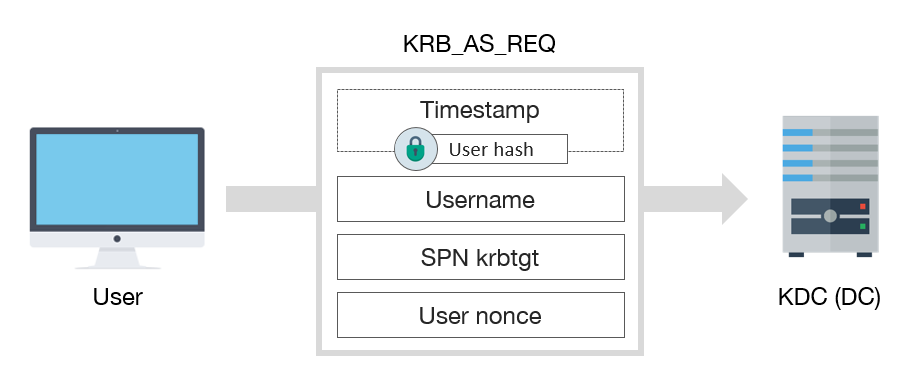
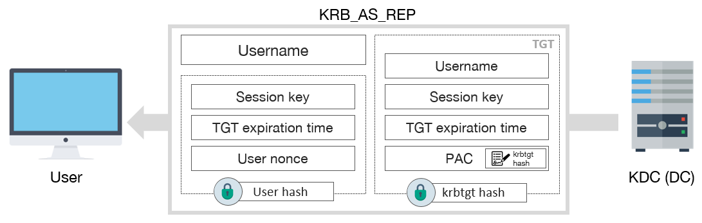
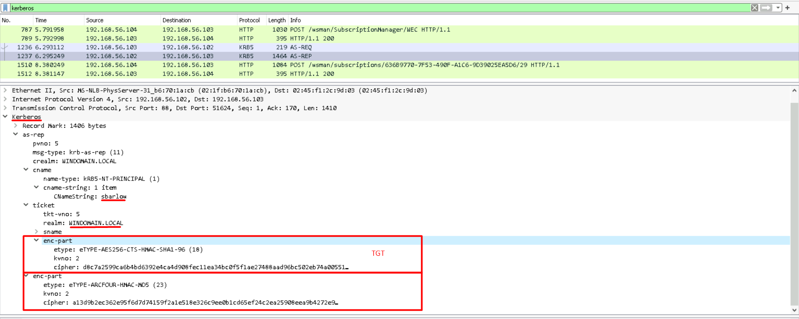
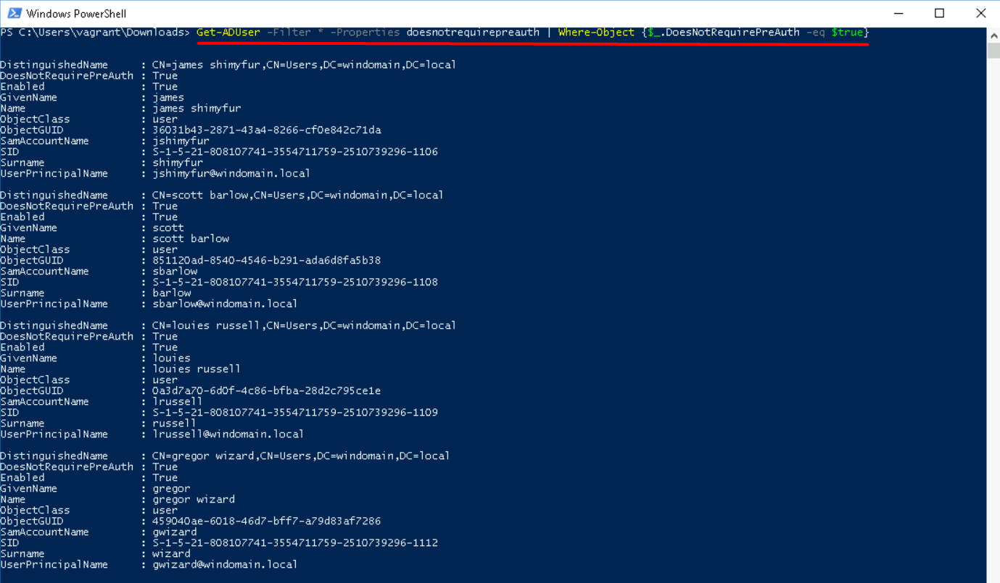
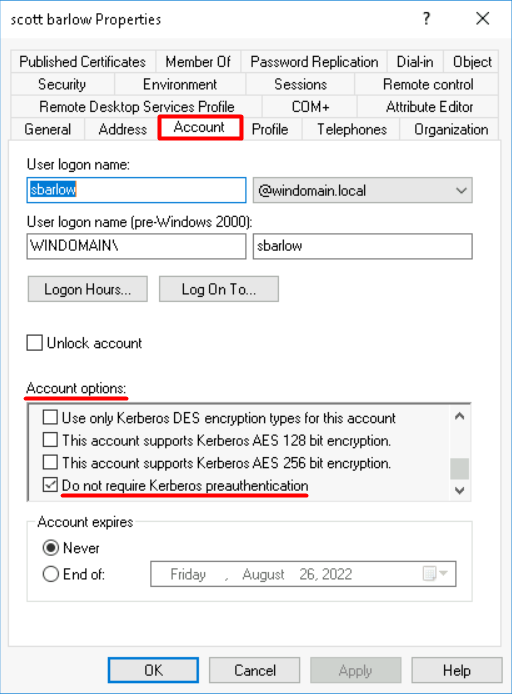
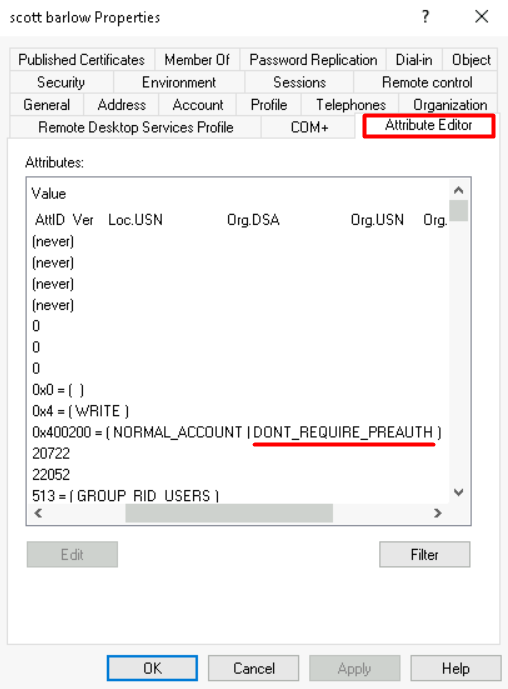
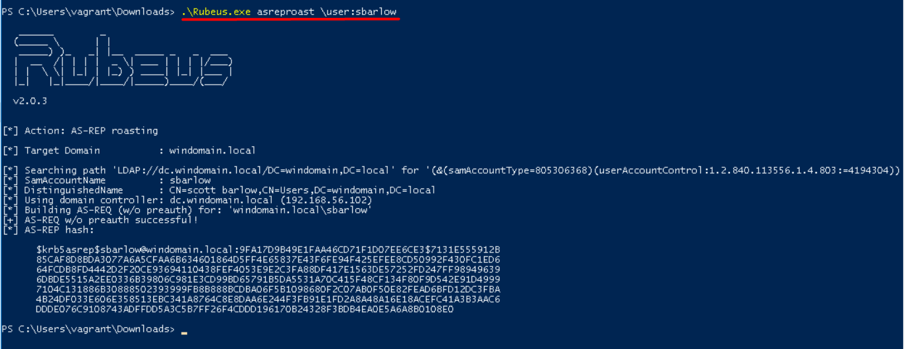
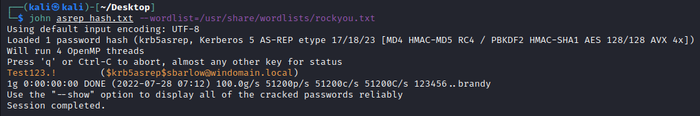
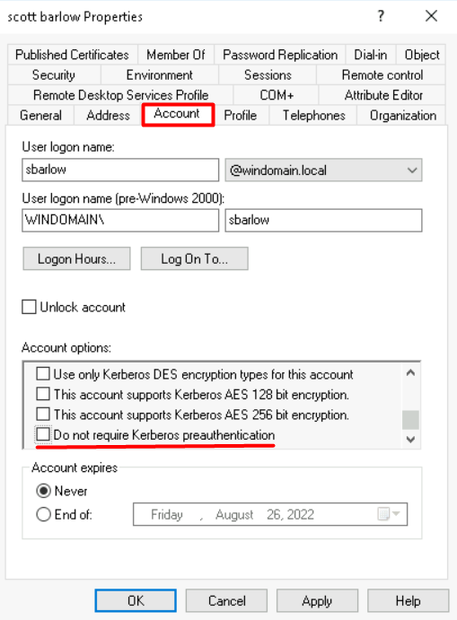

# TTP 0x1 - AS-REPRoasting

| Metric  | Value  |
|---------|--------|
| Severity                      | `High` |
| Ease of Identification        | `Easy` |
| Ease of Mitigation            | `Easy` |
| Ease of Detection             | `Easy` |
| Ease of Deception             | `Easy` |
| MITRE ATT&CK Tactic           | `Credential Access` |
| MITRE ATT&CK Technique        | `Steal or Forge Kerberos Tickets` |
| MITRE ATT&CK Sub-Technique    | `AS-REP Roasting` |
| MITRE ATT&CK ID               | `T1558.004` |
| APT Groups                    | `Unknown`|
| Target                        | `Kerberos Protocol` |
| Tools                         | `Rubeus`, `Impacket/GetNPUsers.py`, `Metasploit` |
| Privilege Before Exploitation | `Domain account` or  `Network Access` or `Network sniffing` |
| Privilege After Exploitation  | `Domain account` or `Privileged Domain account` |
| Version                       | 0.1 |
| Date                          | 28.07.2022 |

## Preliminary

Kerberos, güvenli olmayan ağlar üzerinde bilet (ticket) olarak adlandırılan veri paketlerini kullanarak kimlik doğrulama (authentication) işlemlerini gerçekleştiren bir protokoldür. UDP ve TCP protokollerini kullanmakta ve 88 numaralı port üzerinde çalışmaktadır.  

Active Directory altyapısı ana kimlik doğrulama protokolü olarak Kerberos kullanmaktadır. Kerberos protokolü iletişimi üç taraf arasında gerçekleştirilmektedir.

1.	KDC (Key Distribution Center): Kerberos protokolününde kimlik doğrulama, biletlerin üretilmesi ve doğrulanması gibi işlevleri gerçekleştiren servistir.

2.	İstemci (Client): Servise erişmek için kimlik doğrulama sürecini başlatan objedir.

3.	Uygulama (Application/Servis): İstemcinin kimlik doğrulama sonucunda erişmek istediği servistir.

Kimlik doğrulama işleminin ilk adımında istemciden KDC ye AS-REQ isteği gönderilir. Bu istek içerisinde kullanıcı parolasının parola özeti (NTHash) ile şifrelenmiş zaman damgası (Timestamp), kullanıcı adı (Username), SPN (Service Principal Name) ve rastgele oluşturulan Nonce değerleri bulunur. 



KDC aldığı bu mesaj içerisindeki bilgileri doğrulayarak istemciye AS-REP mesajını gönderir. Bu mesaj içerisinde kullanıcı ismi, kullanıcının parola özeti ile şifrelenmiş bilgiler ve TGT (Ticket Granting Ticket) bileti yer almaktadır. İstemcinin parola özeti ile şifrelenmiş kısımda ise şifreleme için kullanılan Session key, TGT geçerlilik süresi ve rastgele tanımlanmış Nonce değeri bulunmaktadır. TGT bileti ise ktbtgt kullanıcısının parola özeti ile şifrelenmiştir.





Varsayılan koşullarda gerçekleşen bu işlem Pre-Authentication olarak adlandırılmaktadır.

## Description

Active Directory ortamında Pre-Authentication süreci geriye dönük uyumluluk için devre dışı bırakılabilmektedir. Bu sayede kimlik doğrulama işleminin ilk adımı parola bilgisi kullanılmadan gerçekleştirebilmektedir. Bu durumda da AS-REQ mesajında istemci parola özeti ile şifrelenmiş zaman damgası gönderilmemekte fakat AS-REP mesajı başarılı bir şekilde alınabilmektedir.

Pre-Authentication ayarı devre dışı bırakıldığında objenin userAccountControl değerine 0x400000 hex değeri eklenmektedir.

## Impact

Bir obje için Pre-Authentication ayarının devre dışı bırakılması sonucunda Domain Controller sunucusuna ağ erişimi sağlayan herhangi birisi bu objenin parolasını bilmeden objeye ait AS-REP mesajını elde edebilmektedir. Daha sonra da bu mesaj içerisinde objenin parola özeti ile şifrelenmiş kısıma çevrimdışı (offline) olarak kaba-kuvvet (brute-force) saldırısı gerçekleştirebilmektedir. Eğer kaba-kuvvet saldırısı sonucunda parola açık metin (plain-text) olarak elde edilebilirse, hedef kullanıcı hesabı başarılı bir şekilde ele geçirilmiş olacaktır. Bu saldırı yöntemi AS-REPRoasting olarak adlandırılmaktadır.

**Not:** Eğer saldırgan bir şekilde istemci ve DC sunucusu arasındaki trafiği dinleyebiliyorsa, bu zafiyet olmadan da AS-REP paketlerini ele geçirebilir ve bu paketler üzerinde çevrimdışı olarak kaba-kuvvet saldırıları uygulayabilir.

## Identification

Pre-Authentication gerektirmeyen kullanıcıların ve bilgisayarların tespiti için aşağıdaki Powershell betikleri kullanılabilmektedir. 
 
**Not:** Get-ADUser ve Get-ADComputer cmdletleri Powershell ActiveDirectory modülü içerisinde bulunmaktadır. Bu nedenle eğer komut Domain Controller dışında çalıştırılacaksa, bu modül manuel olarak yüklenmelidir.

```powershell
# Pre-Authentication gerektirmeyen kullanıcıların tespiti
Get-ADUser -Filter * -Properties DoesNotRequirePreAuth | Where-Object {$_.DoesNotRequirePreAuth -eq $true}
```

```powershell
# Pre-Authentication gerektirmeyen bilgisayarların tespiti
Get-ADComputer -Filter * -Properties DoesNotRequirePreAuth | Where-Object {$_.DoesNotRequirePreAuth -eq $true}
``` 



Pre-Authentication gerektirmeyen objeler manuel olarak **Active Directory Users and Computers (dsa.msc)** aracı ile tespit edilebilmektedir. Bunun için uygulama üzerinden objenin detay sayfası (Properties) açılır. **Account** sekmesi içerisindeki, **Account options** kısmındaki **"Do Not require Kerberos preauthentication"** kutucuğu işaretli ise Pre-Authentication özelliği devre dışı bırakılmıştır.



Zafiyet ayrıca **Attribute Editor** sekmesi üzerinden **UserAccountControl** değeri analiz edilerek de tespit edilebilmektedir. Eğer bu değer içerisinde **DON'T_REQUIRE_PREAUTH** ibaresi yer alıyorsa, objenin zafiyetli olduğu anlaşılmaktadır.



## Exploitation

AS-REPRoasting saldırısı Rubeus, Impacket, Metasploit ve farklı araçlarla gerçekleştirilebilmektedir. Rubeus domaindeki bir bilgisayar üzerinden çalıştırılarak zafiyetli hesaplar için AS-REQ isteği yaparak AS-REP paketlerini elde edebilmektedir. Aşağıdaki komut çalıştırılarak domaindeki tüm zafiyetli kullanıcılar tespit edilerek, bu kullanıcılar için AS-REPRoasting saldırısı gerçekleştirilebilmektedir.

```powershell
Rubeus.exe asreproast
```

**Not:** Ayrıca **\user** parametresi ile saldırı tekil kullanıcılar için de gerçekleştirilebilir. Bu şekilde saldırı daha sessiz bir şekilde gerçekleştirilecektir.



Rubeus aracıyla şifreli veri elde edildikten sonra John the Ripper veya Hashcat aracıyla kaba kuvvet saldırısı uygulanarak, parola elde edilebilir.



## Mitigation

1. Zafiyetli objeler tespit edildikten sonra bu objelerin kullanıldığı senaryolar ve uygulamalar incelenmelidir. Eğer uygulamalar Pre-Authentication özelliğine ihtiyaç duymadan da çalışabiliyor ise aşağıdaki adımlar uygulanarak Pre-Authentication aktif edilmelidir.

    a. Aşağıdaki Powershell betikleri kullanılarak kullanıcılar ve bilgisayarlar üzerinde Pre-Authentication otomatize bir şekilde aktif edilebilmektedir.

    ```powershell
    # Pre-Authentication özelliğinin kullanıcılar için devre dışı bırakılması
    Get-ADUser -Filter * -Properties DoesNotRequirePreAuth |
    Where-Object {$_.DoesNotRequirePreAuth -eq $true} |
    Set-ADAccountControl -DoesNotRequirePreAuth $false 
    ```

    ```powershell
    # Pre-Authentication özelliğinin bilgisayarlar için devre dışı bırakılması
    Get-ADComputer -Filter * -Properties DoesNotRequirePreAuth |
    Where-Object {$_.DoesNotRequirePreAuth -eq $true} |
    Set-ADAccountControl -DoesNotRequirePreAuth $false 
    ```

    **Not:** Bu betiklerle tüm zafiyetli objeler üzerinde değişiklik otomatize bir şekilde gerçekleştirilmektedir. Eğer ortamdaki servislerin gereksinimleri doğru analiz edilmemişse bu işlem kesintilere sebep olabilmektedir. Bu gibi kesintilerin yaşanmaması için giderme işlemi **Filter** veya **Identity** parametreleri kullanılarak tekil bir şekilde de gerçekleştirebilmektedir.

    ```powershell
    # Pre-Authentication özelliğinin tekil olarak devre dışı bırakılması
    Get-ADUser -Identity <object_samaccountname> -Properties DoesNotRequirePreAuth |
    Where-Object {$_.DoesNotRequirePreAuth -eq $true} |
    Set-ADAccountControl -DoesNotRequirePreAuth $false 
    ```

    b. Zafiyeti giderme işlemi **Active Directory Users and Computers (dsa.msc)** aracı ile manuel olarak da gerçekleştirilebilmektedir. Bunun için uygulama üzerinden objenin detay sayfası (Properties) açılır. **Account** sekmesi içerisindeki, **Account options** kısmındaki **"Do Not require Kerberos preauthentication"** kutucuğundaki işaret kaldırılarak zafiyet giderilebilmektedir.

    

2. Eğer zafiyet, uygulama veya servislerdeki bağımlılıklardan ötürü kapatılamıyorsa, aşağıdaki adımlar uygularak ek güvenlik önlemleri alınmalıdır.
    
    a. Zafiyetli objeler için kaba-kuvvet saldırıları ile tespit edilemeyecek güçlü parolalar ve parola politikaları uygulanmalıdır. Bu sayede saldırgan şifreli veriyi ele geçirse bile parolanın açık metin haline erişemeyecektir.

    b. Zafiyetli objeler detaylı bir şekilde monitör edilmeli ve normalin dışındaki aksiyonların (oturum açma, farklı bir servise erişim vb) tespit edilebilmesi için gerekli altyapı oluşturulmalıdır.

## Detection

AS-REPRoasting saldırısının farklı fazlarda tespiti için aşağıdaki Event ID bilgileri ve Sigma kuralları incelenmeli ve kurum bünyesinde tespit teknolojileri üzerinde uygulanmalıdır.

| Event Id  | Title | Description |
|---------|--------|--------|
| 4738 | `A user account was changed.` | Kullanıcılarda Pre-Authentication ayarının devre dışı bırakılması tespit edilebilmektedir. |
| 4742 | `A computer account was changed.` | Bilgisayarlarda Pre-Authentication ayarının devre dışı bırakılması tespit edilebilmektedir. |
| 4662 | `An operation was performed on an object.` | Objelerin userAccountControl değeri üzerinde yapılan okumalar tespit edilebilmektedir. |
| 4768 | `A Kerberos authentication ticket (TGT) was requested.` | Kerberos Pre-Authentication gerçekleştirilmeden yapılan TGT istekleri tespit edilebilmektedir. |
| 5136 | `A directory service object was modified.` | Objelerin userAccountControl değeri üzerinde yapılan yazma işlemleri tespit edilebilmektedir. |
| 3    | `Network connection` | DC üzerindeki Kerberos servisine erişim sağlayan processler tespit edilebilmektedir. |

| Rule Id  | Title | TTP | Stage | Source | Event Id |
|---------|--------|--------|--------|--------|--------|
| 0x1 | [Pre-Authentication Disabled on Computer Account (AS-REP Roasting)](detection-rules/Rule%200x1%20-%20Pre-Authentication%20Disabled%20on%20Computer%20Account.yaml) | `AS-REP Roasting` | `Vulnerability`, `Persistence` | Security | 4742 |
| 0x2 | [Pre-Authentication Disabled on User Account (AS-REP Roasting)](detection-rules/Rule%200x2%20-%20Pre-Authentication%20Disabled%20on%20User%20Account.yaml) | `AS-REP Roasting` | `Vulnerability`, `Persistence` | Security | 4738 |
| 0x3 | [UserAccountControl Attribute Enumeration](detection-rules/Rule%200x3%20-%20UserAccountControl%20Attribute%20Enumeration.yaml) | `Multiple` | `Enumeration` | Security | 4662 |
| 0x4 | [Kerberos TGT Request without Pre-Authentication (AS-REP Roasting)](detection-rules/Rule%200x4%20-%20Kerberos%20TGT%20Request%20without%20Pre-Authentication.yaml) | `AS-REP Roasting` | `Exploitation` | Security | 4768 |
| 0x5 | [Kerberos TGT Request (AS-REQ) with RC4 Encryption (Possible malicious tool usage Mimikatz/Rubeus etc)](detection-rules/Rule%200x5%20-%20Kerberos%20TGT%20Request%20with%20RC4%20Encryption.yaml) | `Multiple` | `Exploitation` | Security | 4768 |
| 0x6 | [Kerberos TGT Request (AS-REQ) with DES Encryption](detection-rules/Rule%200x6%20-%20Kerberos%20TGT%20Request%20with%20DES%20Encryption.yaml) | `Multiple` | `Exploitation` | Security | 4768 |
| 0x7 | [UserAccountControl Attribute Modification](detection-rules/Rule%200x7%20-%20UserAccountControl%20Attribute%20Modification.yaml) | `Multiple` | `Vulnerability`, `Persistence` | Security | 5136 |
| 0x8 | [Kerberos TGT Request (AS-REQ) with RC4 Encryption](detection-rules/Rule%200x8%20-%20Kerberos%20TGT%20Request%20with%20RC4%20Encryption.yaml)| `Multiple` | `Exploitation` | Zeek | N/A | 
| 0x9 | [Kerberos Network Connection Initiated by Suspicious Process](detection-rules/Rule%200x9%20-%20Kerberos%20Network%20Connection%20Initiated%20by%20Suspicious%20Process.yaml)| `Multiple` | `Exploitation` | Sysmon | 3 | 

## References

- https://forestall.io/blog/en/kerberos-protocol-security-1/
- https://ldapwiki.com/wiki/Kerberos%20Pre-Authentication
- http://www.kerberos.org/software/tutorial.html
- https://harmj0y.medium.com/roasting-as-reps-e6179a65216b
- https://attack.mitre.org/techniques/T1558/004/
- https://docs.microsoft.com/en-us/windows/security/threat-protection/auditing/event-4768
- https://docs.microsoft.com/en-us/windows/security/threat-protection/auditing/event-4768#table-5-kerberos-pre-authentication-types
- https://docs.microsoft.com/en-us/windows/security/threat-protection/auditing/event-4738
- https://docs.microsoft.com/en-us/windows/security/threat-protection/auditing/event-4742
- https://docs.microsoft.com/en-us/windows/security/threat-protection/auditing/event-4662
- https://docs.microsoft.com/en-us/windows/security/threat-protection/auditing/event-5136

## Authors

- Serdal Tarkan Altun