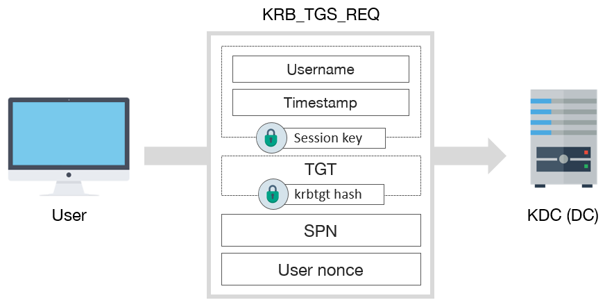
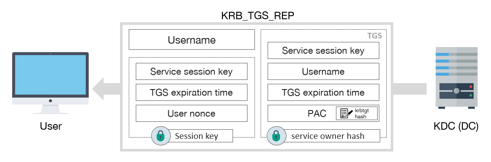

# TTP 0x2 - Kerberoasting

| Metric  | Value  |
|---------|--------|
| Severity                      | `High` |
| Ease of Identification        | `Easy` |
| Ease of Mitigation            | `Medium` |
| Ease of Detection             | `Hard` |
| Ease of Deception             | `Easy` |
| MITRE ATT&CK Tactic           | `Credential Access` |
| MITRE ATT&CK Technique        | `Steal or Forge Kerberos Tickets` |
| MITRE ATT&CK Sub-Technique    | `Kerberoasting` |
| MITRE ATT&CK ID               | `T1558.003` |
| APT Groups                    | `APT29`, `FIN7`, `Operation Wocao`, `Wizard Spider`|
| Target                        | `Kerberos Protocol` |
| Tools                         | `Rubeus`, `Impacket`, `PowerSploit`, `kerberoast`, `Mimikatz` |
| Privilege Before Exploitation | `Domain account` or `Network sniffing` |
| Privilege After Exploitation  | `Domain account` or `Privileged Domain account` |
| Version                       | 0.1 |
| Date                          | 13.08.2022 |

## Preliminary

Kerberos, güvenli olmayan ağlar üzerinde bilet (ticket) olarak adlandırılan veri paketlerini kullanarak kimlik doğrulama (authentication) işlemlerini gerçekleştiren bir protokoldür. UDP ve TCP protokollerini kullanmakta ve 88 numaralı port üzerinde çalışmaktadır.  

Active Directory altyapısı 

1.	KDC (Key Distribution Center): Kerberos protokolününde kimlik doğrulama, biletlerin üretilmesi ve doğrulanması gibi işlevleri gerçekleştiren servistir.

2.	İstemci (Client): Servise erişmek için kimlik doğrulama sürecini başlatan objedir.

3.	Uygulama (Application/Servis): İstemcinin kimlik doğrulama sonucunda erişmek istediği servistir.

Servis erişim işleminin ilk adımında istemciden KDC ye TGS-REQ isteği gönderilir. Bu istek içerisinde Session Key 1 değeri ile şifrelenmiş kullanıcı adı (Username) ve zaman damgası (Timestamp), krbtgt parola özeti ile şifrelenmiş TGT, SPN (Service Principal Name) ve rastgele oluşturulan Nonce değerleri bulunur.



KDC aldığı bu mesaj içerisindeki bilgileri doğrulayarak istemciye TGS-REP mesajı gönderir. Bu mesaj içerisinde kullanıcı ismi, Session Key 2 değeri ile şifrelenmiş bilgiler ve TGS (Ticket Granting Service) bileti yer almaktadır. Session Key 2 ile şifrelenmiş kısımda ise istemciden gelen Session Key 1, TGS geçerlilik süresi ve rastgele tanımlanmış Nonce değeri bulunmaktadır. TGS bileti ise yetkil servis kullanıcısının parola özeti ile şifrelenmiştir.



## Description

Active Directory ortamında SPN (Service Principal Name) attribute değeri dolu olan kullanıcılar için TGS bileti talep edilebilmekte ve bu şekilde servislere erişim sağlanabilmketedir.

SPN (Service Principal Name) attribute değeri kontrol edilerek servis kullanıcıları bulunabilmektedir.

## Impact

SPN değeri dolu olan kullanıcılar tespit edilmesi sonucunda bu kullanıcılar için KDC den TGS-REP talep edilebilmektedir. RC4 şifreleme kullanılmış TGS-REP biletlerinde servis kullanıcısının parola özeti ile şifrelenmiş kısıma (offline) kaba-kuvvet (brute-force) saldırısı gerçekleştirilebilmektedir. Eğer kaba-kuvvet saldırısı sonucunda parola açık metin (plain-text) olarak elde edilirse, servis kullanıcı hesabı ele geçirilmiş olacaktır. Bu saldırı yöntemi Kerberoasting olarak adlandırılmaktadır. 

## Identification

ServicePrincipalName değeri dolu olan yani herhangi bir servisi yöneten kullanıcıların tespiti için aşağıdaki Powershell betikleri kullanılabilmektedir.

**Not:** Get-ADUser cmdleti Powershell ActiveDirectory modülü içerisinde bulunmaktadır. Bu nedenle eğer komut Domain Controller dışında çalıştırılacaksa, bu modül manuel olarak yüklenmelidir.

**Not:** krbtgt hesabı varsayılan olarak SPN değerine sahip olduğu için göz ardı edilmektedir.

```powershell
# ServicePrincipalName Attribute bilgileri dolu olan kullanıcılar tespiti
Get-ADUser -Filter { servicePrincipalName -like "*" -and SamAccountName -ne "krbtgt" } -Properties servicePrincipalName
```

## Exploitation

Kerberoasting saldırısı Rubeus aracıyla gerçekleşirilebilmektedir. Rubeus domaindeki bir bilgisayar üzerinde çalıştırılarak SPN değeri dolu kullanıcılar için TGS-REQ isteği yaparak TGS-REP elde edebilmektedir. Aşağıdaki komut çalıştırılarak domaindeki SPN değeri bulunan kullanıcılar tespit edilerek Kerberoasting saldırısı gerçekleştirebilmektedir.

```powershell
Rubeus.exe kerberoast
```

**Not:** ayrica **/user** parametresi ile saldırı tekil kullanıcılar için de gerçekleştirilebilir. Bu şekilde saldırı daha sessiz bir şekilde gerçekleştirilecektir.


Rubeus aracıyla şifreli veri elde edildikten sonra John the Ripper veya Hashcat aracıyla kaba kuvvet saldırısı uygulanarak, parola elde edilebilir.


## Mitigation

1. Objeler için kaba-kuvvet saldırıları ile tespit edilemeyecek güçlü parolalar ve parola politikaları uygulanmalıdır. Bu sayede saldırgan şifreli veriyi ele geçirse bile parolanın açık metin haline erişemeyecektir.

2. Servis hesaplarının güvenliği için Managed Service Account (MSA) veya Group Managed Service Account (GMSA) oluşturulmalı. GMSA hesabının parola politikası 120 karakter uzunluğunda ve 30 günde bir otomotize şekilde değiştirilmektedir. Hiçbir parola politikasından etkilenmeyerek servislere interactive logan olmayıda engelemektedir.

## Detection

Kerberoasting saldırısının farklı fazlarda tespiti için aşağıdaki Event ID bilgileri ve Sigma kuralları incelenmeli ve kurum bünyesinde tespit teknolojileri üzerinde uygulanmalıdır.

| Event Id  | Title | Description |
|---------|--------|--------|
| 4738 | `A user account was changed.` | Kullanıcılarda userAccountControl ayarı üzerinden DES algoritmasının aktif edilmesi tespit edilebilmektedir. |
| 4662 | `An operation was performed on an object.` | Objelerin ServicePrincipalName ve msDS-SupportedEncryptionType değeri üzerinde yapılan okumalar tespit edilebilmektedir. |
| 4769 | `A Kerberos service ticket was requested.` | Kerberos TGS istekleri ve şifreleme türleri tespit edilebilmektedir. |
| 5136 | `A directory service object was modified.` | Objelerin ServicePrincipalName ve msDS-SupportedEncryptionType değeri üzerinde yapılan yazma işlemleri tespit edilebilmektedir. |
| 3    | `Network connection` | DC üzerindeki Kerberos servisine erişim sağlayan processler tespit edilebilmektedir. |

**4662** ve **5136** ID'li logları aktif edebilmek için SACL (System Access Control Entry) tanımı yapılması gerekmektedir. Aşağıdaki linkte bulunan Powershell fonksiyonu ile objeler üzerinde otomatize bir şekilde SACL oluşturulabilmektedir.

[Create-SACL.ps1](scripts/Create-SACL.ps1)

Aşağıda bulunan Powershell betiği ile de ServicePrincipalName değerine sahip tüm kullanıcılar (krbtgt hariç) üzerinde otomotize bir şekilde SACL(System Access Control List) oluşturulabilmektedir.

```powershell
# Import Create-SACL helper function 
. .\Create-SACL.ps1

# Retrieving service accounts with using servicePrincipalName attribute but filtering krbtgt account
Get-ADUser -Filter {serviceprincipalname -like "*" -and samAccountName -ne "krbtgt"} | 

# Iterating service accounts to create appropriate SACL entries
ForEach-Object {
    # Creating SACL from Everyone for Write and Read actions on ServicePrincipalName attribute
    # With these entries any read/enumeration or write/modification operation on ServicePrincipalName attribute logged with Event ID 4662 and 5136 
    Create-SACL -Right WriteProperty -GUID f3a64788-5306-11d1-a9c5-0000f80367c1 -DistinguishedName $_.DistinguishedName
    Create-SACL -Right ReadProperty -GUID f3a64788-5306-11d1-a9c5-0000f80367c1 -DistinguishedName $_.DistinguishedName

    # Creating SACL from Everyone for Write and Read actions on ms-DS-Support-Encrypted-Type attribute
    # With these entries any read/enumeration or write/modification operation on ms-DS-Support-Encrypted-Type attribute logged with Event ID 4662 and 5136 
    Create-SACL -Right WriteProperty -GUID 20119867-1d04-4ab7-9371-cfc3d5df0afd -DistinguishedName $_.DistinguishedName
    Create-SACL -Right ReadProperty -GUID 20119867-1d04-4ab7-9371-cfc3d5df0afd -DistinguishedName $_.DistinguishedName
}
```

| Rule Id  | Title | TTP | Stage | Source | Event Id |
|---------|--------|--------|--------|--------|--------|
| 0x1 | [ServicePrincipalName Attribute Modification on User Accounts](detection-rules/Rule%200x1%20-%20ServicePrincipalName%20Attribute%20Modification.yaml) | `Kerberoasting` | `Vulnerability` | Security | 5136 |
| 0x2 | [msDS-SupportedEncryptionTypes Attribute Modification on User Accounts](detection-rules/Rule%200x2%20-%20msDS-SupportedEncryptionTypes%20Attribute%20Modification.yaml) | `Multiple` | `Vulnerability` | Security | 5136 |
| 0x3 | [DES Encryption Enabled on User Account](detection-rules/Rule%200x3%20-%20DES%20Encryption%20Enabled%20on%20User%20Account.yaml) | `Multiple` | `Vulnerability` | Security | 4738 |
| 0x4 | [ServicePrincipalName Attribute Enumeration](detection-rules/Rule%200x4%20-%20ServicePrincipalName%20Attribute%20Enumeration%20.yaml) | `Multiple` | `Enumeration` | Security | 4662 |
| 0x5 | [msDS-SupportedEncryptionTypes Attribute Enumeration](detection-rules/Rule%200x5%20-%20msDS-SupportedEncryptionTypes%20Attribute%20Enumeration.yaml) | `Multiple` | `Enumeration` | Security | 4662 |
| 0x6 | [Kerberos TGS Request (TGS-REQ) with RC4 Encryption (Possible malicious tool usage Mimikatz/Rubeus etc)](detection-rules/Rule%200x6%20-%20Kerberos%20TGS%20Request%20with%20RC4%20Encryption.yaml) | `Kerberoasting` | `Exploitation` | Security | 4769 |
| 0x7 | [Kerberos TGS Request (TGS-REQ) with DES Encryption](detection-rules/Rule%200x7%20-%20Kerberos%20TGS%20Request%20with%20DES%20Encryption.yaml) | `Kerberoasting` | `Exploitation` | Security | 4769 |
| 0x8 | [Kerberos TGS Request (TGS-REQ) with RC4 Encryption (Zeek)](detection-rules/Rule%200x8%20-%20Kerberos%20TGS%20Request%20with%20RC4%20Encryption%20(Zeek).yaml) | `Kerberoasting` | `Exploitation` | Zeek |  |
| 0x9 | [Kerberos Network Connection Initiated by Suspicious Process (Possible usage of Rubeus, Mimikatz, Kekeo etc)](detection-rules/Rule%200x9%20-%20Kerberos%20Network%20Connection%20Initiated%20by%20Suspicious%20Process.yaml)| `Multiple` | `Exploitation` | Sysmon | 3 |

## References

- https://forestall.io/blog/en/kerberos-protocol-security-1/
- http://www.kerberos.org/software/tutorial.html
- https://posts.specterops.io/kerberoasting-revisited-d434351bd4d1
- https://attack.mitre.org/techniques/T1558/003/
- https://docs.microsoft.com/en-us/windows/security/threat-protection/auditing/event-4769
- https://docs.microsoft.com/en-us/windows/security/threat-protection/auditing/event-4738
- https://docs.microsoft.com/en-us/windows/security/threat-protection/auditing/event-4662
- https://docs.microsoft.com/en-us/windows/security/threat-protection/auditing/event-5136

## Authors

- Serdal Tarkan Altun