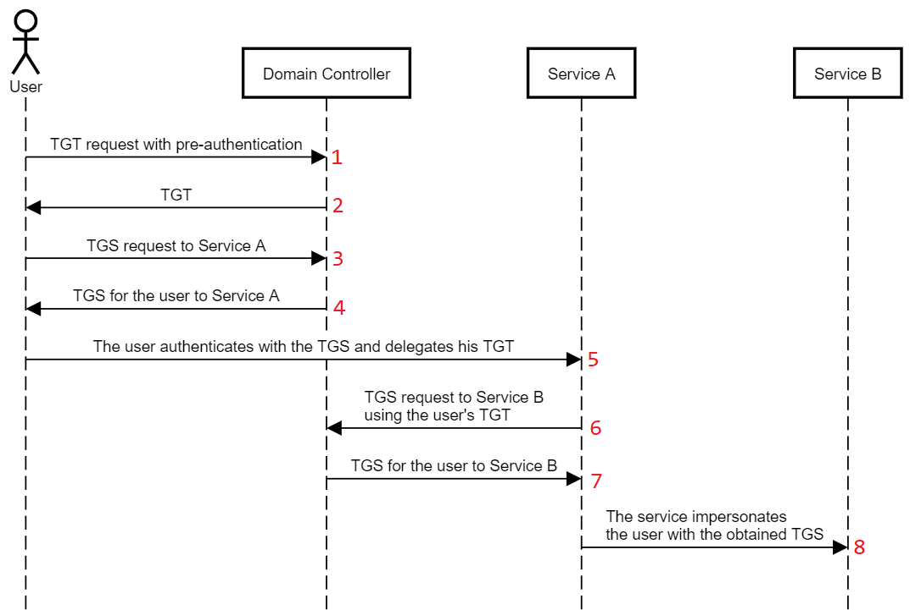
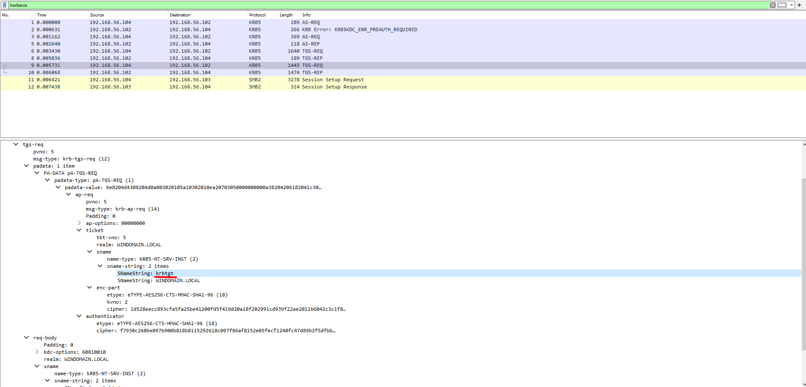
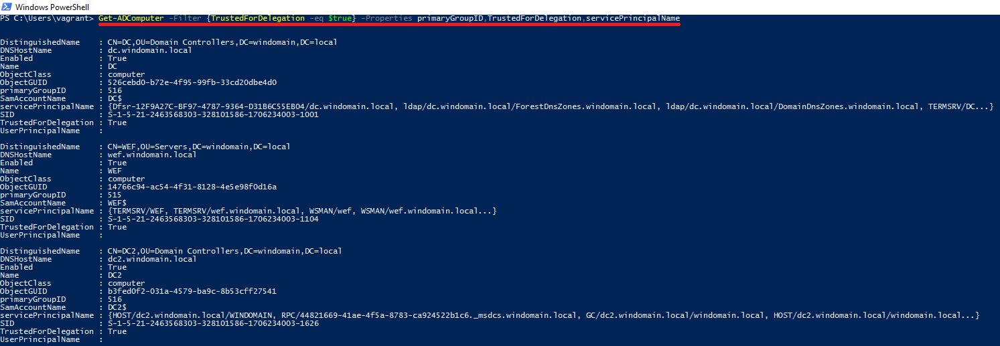
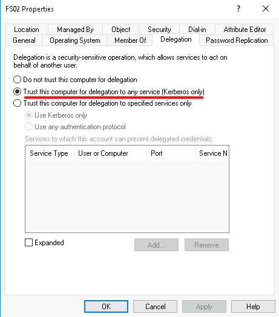
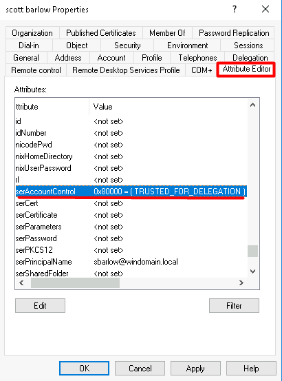
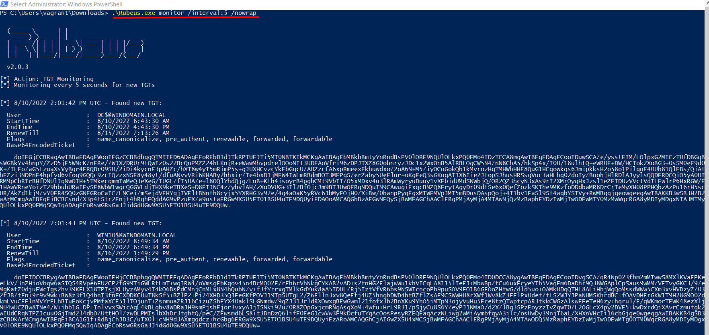
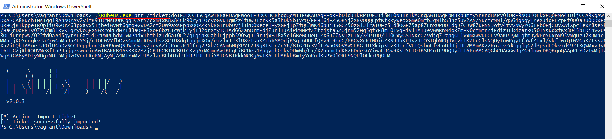
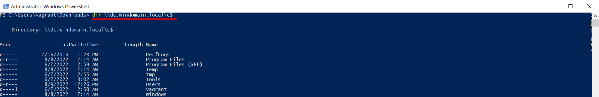
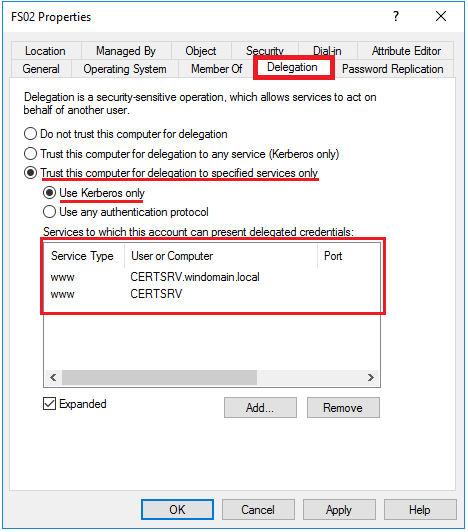
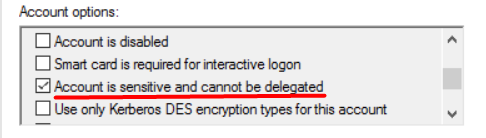

# TTP 0x3 - Unconstrained Delegation

| Metric  | Value  |
|---------|--------|
| Severity                      | `High` |
| Ease of Identification        | `Easy` |
| Ease of Mitigation            | `Medium` |
| Ease of Detection             | `Hard` |
| Ease of Deception             | `Easy` |
| MITRE ATT&CK Tactic           | `Credential Access` |
| MITRE ATT&CK Technique        | `Steal or Forge Kerberos Tickets` |
| MITRE ATT&CK Sub-Technique    | `N/A` |
| MITRE ATT&CK ID               | `T1558` |
| APT Groups                    | `N/A`|
| Target                        | `Kerberos Protocol` |
| Tools                         | `Rubeus`, `Mimikatz` |
| Privilege Before Exploitation | `Unconstrained Delegation Enabled Object` |
| Privilege After Exploitation  | `Privileged Domain Account` |
| Version                       | 0.1 |
| Date                          | 11.08.2022 |

## Preliminary

Kerberos, güvenli olmayan ağlar üzerinde bilet (ticket) olarak adlandırılan veri paketlerini kullanarak kimlik doğrulama (authentication) işlemlerini gerçekleştiren bir protokoldür. UDP ve TCP protokollerini kullanmakta ve 88 numaralı port üzerinde çalışmaktadır.  

Active Directory altyapısı ana kimlik doğrulama protokolü olarak Kerberos kullanmaktadır. Kerberos protokolü iletişimi üç taraf arasında gerçekleştirilmektedir.

1.	KDC (Key Distribution Center): Kerberos protokolününde kimlik doğrulama, biletlerin üretilmesi ve doğrulanması gibi işlevleri gerçekleştiren servistir.

2.	İstemci (Client): Servise erişmek için kimlik doğrulama sürecini başlatan objedir.

3.	Uygulama (Application/Servis): İstemcinin kimlik doğrulama sonucunda erişmek istediği servistir.

### Kerberos Double Hop

Kerberos protokolünün doğası gereği uygulama kendisine erişen istemcinin kimlik bilgileri ile başka sunuculara erişmesine izin vermemektedir. Bu durum uygulamanın kendisine iletilen ST (Service Ticket) ile diğer servis için istemciye ait farklı bir bilet üretememesinden kaynaklanmaktadır. Bu durum Kerberos Double Hop problemi olarak adlandırılmaktadır. Microsoft bu problemi çözmek için Kerberos protokolünü çeşitli delegasyon yöntemleri ile geliştirmişir. 

-   Unconstrained Delegation (Kısıtlamasız Delegasyon)
-   Costrained Delegation (Kısıtlanmış Delegasyon)
-   Resource Based Constrained Delegation (Kaynak Tabanlı Kısıtlanmış Delegasyon)

### Unconstrained Delegation 

Microsoft, Windows 2000 ile birlikte Kerberos Unconstrained Delegation yöntemini ortaya koymuştur. Bu yöntem sayesinde delegasyon tanımlanan sunucu kendisine erişen objeleri (kullanıcı, bilgisayar vb) Active Directory ortamındaki diğer tüm servislere erişirken taklit (impersonate) edebilmektedir.

Bir sunucu üzerinde bu delegasyon tanımlandığında, bu sunucuya erişen objeler, sunucuya ST (Service Ticket/TGS) biletinin yanı sıra TGT (Ticket Granting Ticket) biletini de iletmektedir (Adım 5). Bu sayede sunucu TGT biletini kullanarak o obje için ortamdaki tüm servislere erişebilecek ST biletlerini Domain Controller sunucusundan alabilmektedir. (Adım 6,7) Sonuç olarak yeni oluşturulan ST bileti ile diğer sunucuya/servise erişim Kerberos protokolü ile sağlanmış ve bu sayede de Double Hop problemi çözülmüş olur. (Adım 8)



PCAP dosyasında görüldüğü gibi normal Kerberos protokolüne ek olarak TGS-REQ, TGS-REP mesajları görülmektedir. Bu mesajlar ile istemci, Unconstrained Delegation aktif olan sunucuya göndereceği TGT biletini elde etmektedir.



## Description

Active Directory ortamında Unconstrained Delegation yöntemi, sunucuların istemcilerin kimlik bilgileriyle diğer servislere erişim sağlayabilmesi ve Double Hop probleminin çözülebilmesi için aktif edilebilmektedir. 

Unconstrained Delegation ayarı aktif edildiğinde objenin UserAccountControl değerine **0x80000** hex değeri eklenmektedir.

**Not:** Domain Controller sunucularında Unconstrained Delegation tanımı varsayılan olarak aktiftir.

## Impact

Delegasyon tanımlı sunucu kendisine erişen istemcinin TGT’sini aldığı için bu TGT ile ortamdaki tüm sunuculardaki tüm servislere erişmek için istemciyi taklit edebilmektedir. Bu nedenle eğer saldırgan bu sunucuyu ele geçirebilirse sunucuya erişen tüm istemcilerin TGT biletlerini bu sayede de istemci hesaplarını ele geçirebilecektir. Eğer bu sunucuya yetkili bir kullanıcı erişirse saldırgan kolaylıkla yetki yükseltebilecektir.

Unconstrained Delegation tanımı aktif edilen sunucuya hiçbir kullanıcı erişmese dahi saldırgan Coercion yöntemlerini (PrinterBug, PetitPotam vb) kullanarak kullanarak DC sunucusundan veya diğer yetkili sunuculardan delegasyon tanımlı sunucuya istek yaptırabilir. Bu istek sayesinde de DC sunucusunun bilgisayar hesabını ele geçirebilir. DC sunucusunun bilgisayar hesabı ile de DCSync isimli saldırıyı yaparak ortamdaki tüm kullanıcıların parola bilgileri elde edebilir.

Ayrıca saldırgan Coercion yöntemlerini kullanarak delegasyon tanımlı sunucuya diğer domaindeki DC sunucularından da istek yaptırabilir. Bu istek sayesinde de diğer domaindeki DC sunucusunun bilgisayar hesabını ele geçirerek kolayca diğer domaine veya forestta geçiş yapabilir. Bu durum da saldırganın tüm kurumsal Active Directory yapısını ele geçirmesine olanak sağlamaktadır.

## Identification

Unconstrained Delegation tanımı aktif edilmiş kullanıcıların ve bilgisayarların tespiti için aşağıdaki Powershell betikleri kullanılabilmektedir. 
 
**Not:** Get-ADUser ve Get-ADComputer cmdletleri Powershell ActiveDirectory modülü içerisinde bulunmaktadır. Bu nedenle eğer komut Domain Controller dışında çalıştırılacaksa, bu modül manuel olarak yüklenmelidir.

```powershell
# Unconstrained Delegation aktif edilmiş bilgisayarların tespiti
Get-ADComputer -Filter {TrustedForDelegation -eq $true} -Properties primaryGroupID,TrustedForDelegation,servicePrincipalName
```

```powershell
# Unconstrained Delegation aktif edilmiş kullanıcıların tespiti
Get-ADUser -Filter {TrustedForDelegation -eq $true} -Properties primaryGroupID,TrustedForDelegation,servicePrincipalName
```



Unconstrained Delegation aktif edilmiş objeler manuel olarak **Active Directory Users and Computers (dsa.msc)** aracı ile tespit edilebilmektedir.Bunun için uygulama üzerinden objenin detay sayfası (Properties) açılır. **Delegation** sekmesi içerisindeki, **"Trust this computer for delegation to any service(Kerberos only)"** kutucuğu işaretli ise Unconstrained Delegation özelliği aktif edilmiştir.



Zafiyet ayrıca **Attribute Editor** sekmesi üzerinden **UserAccountControl** değeri analiz edilerek de tespit edilebilmektedir. Eğer bu değer içerisinde **TRUSTED_FOR_DELEGATION** ibaresi yer alıyorsa, objenin zafiyetli olduğu anlaşılmaktadır.



**Not:** Kullanıcılar için **Delegation** tabı direkt olarak görünür değildir. Bu nedenle kullanıcılar üzerinde Unconstrained Delegation tanımı **Attribute Editor** üzerinden kontrol edilmelidir.

## Exploitation

Unconstrained Delegation zafiyeti Rubeus, Mimikatz ve farklı araçlarla sömürülebilmektedir. Unconstrained Delegation tanımı aktif edilmiş sunucu ele geçirildikten sonra aşağıdaki komut ile Rubeus monitor modda çalıştırılmaktadır. Monitor modda sunucuya iletilen TGT biletleri ele geçirilebilmekte ve dışarı aktarılabilmektedir.  

```powershell
Rubeus.exe monitor /interval:5 /nowrap
```



Elde edilen TGT bileti ile bağlanılmak istenen servis için Rubeus aracı ile ST bileti elde edilebilmektedir. Veya TGT bileti direkt PTT (Pass the Ticket) yöntemi ile belleğe (memory) kaydedilerek (inject) erişmek istenilen servise normal bir şekilde erişim sağlanabilmektedir.

```powershell
Rubeus.exe ptt /ticket:<TGT>
```



Aşağıdaki görselde PTT yöntemi ile belleğe kaydedilen yetkili bir kullanıcıya ait TGT sayesinde DC sunucusunun C$ paylaşımına erişilebildiği görülmektedir. 

```powershell
dir \\dc.windomain.local\c$
```



## Mitigation

1. Zafiyetli objeler tespit edildikten sonra bu objelerin kullanıldığı senaryolar ve uygulamalar incelenmelidir. Eğer uygulamalar Unconstrained Delegation özelliğine ihtiyaç duymadan da çalışabiliyor ise aşağıdaki adımlar uygulanarak Unconstrained Delegation devre dışı bırakılmalıdır.

    a. Aşağıdaki Powershell betikleri kullanılarak kullanıcılar ve bilgisayarlar üzerinde Unconstrained Delegation tanımı otomatize bir şekilde devre dışı bırakılabilmektedir.

    ```powershell
    # Unconstrained Delegation özelliği kullanıcılar için devre dışı bırakılması
    Get-ADUser -Filter * -Properties TrustedForDelegation |
    Where-Object {$_.TrustedForDelegation -eq $true} |
    Set-ADAccountControl -TrustedForDelegation $false 
    ```

    ```powershell
    # Unconstrained Delegation özelliği bilgisayarlar için devre dışı bırakılması
    $domain_controllers = Get-ADDomainController | Select-Object -ExpandProperty ComputerObjectDN;
    Get-ADComputer -Filter * -Properties TrustedForDelegation | 
    Where-Object {($_.TrustedForDelegation -eq $true) -and ($domain_controllers -notcontains $_.DistinguishedName)} |
    Set-ADAccountControl -TrustedForDelegation $false
    ```

    **Not:** Bu betiklerle tüm zafiyetli objeler üzerinde değişiklikler otomatize bir şekilde gerçekleştirilmektedir. Eğer ortamdaki servislerin gereksinimleri doğru analiz edilmemişse bu işlem kesintilere sebep olabilmektedir. Bu gibi kesintilerin yaşanmaması için giderme işlemi **Filter** veya **Identity** parametreleri kullanılarak tekil bir şekilde de gerçekleştirebilmektedir.

    ```powershell
    # Unconstrained Delegation özelliğinin tekil olarak devre dışı bırakılması
    Get-ADComputer -Identity <object_samaccountname> -Properties TrustedForDelegation |
    Where-Object {$_.TrustedForDelegation -eq $true} |
    Set-ADAccountControl -TrustedForDelegation $false 
    ```

    ```powershell
    # Unconstrained Delegation özelliğinin tekil olarak devre dışı bırakılması
    Get-ADUser -Identity <object_samaccountname> -Properties TrustedForDelegation |
    Where-Object {$_.TrustedForDelegation -eq $true} |
    Set-ADAccountControl -TrustedForDelegation $false 
    ```

    b. Zafiyeti giderme işlemi **Active Directory Users and Computers (dsa.msc)** aracı ile manuel olarak da gerçekleştirilebilmektedir. Bunun için uygulama üzerinden objenin detay sayfası (Properties) açılır. **Account** sekmesi içerisindeki, **Account options** kısmındaki **"Trust this computer for delegation to any service(Kerberos only)"** kutucuğu yerine **"Do not trust this computer for delegation"** kutucuğu işaretlenerek Unconstrained Delegation devre dışı bırakılabilmektedir.

    

2. Eğer Unconstrained Delegation kapatılamıyorsa, servisler/uygulamalar incelenmeli ve eğer mimari uygunsa daha güvenli olan Constrained Delegation yöntemi kullanılmalıdır. Bu yöntemde servis sadece izin verilen servislere erişirken istemciyi taklit edebilmektedir. Bu şekilde de risk kısıtlanabilmektedir. Constrained Delegation ayarı benzer şekilde **Active Directory Users and Computers (dsa.msc)** uygulaması üzerinden konfigüre edilebilmektedir. Bu işlem için uygulama üzerinden objenin detay sayfası (Properties) açılır. **Account** sekmesi içerisindeki, **Account options** kısmındaki **"Trust this computer for delegation to any service(Kerberos only)"** kutucuğu yerine **"Trust this computer for delegation to specified services only"** ve **"Use Kerberos only"** kutucukları işaretlenir. Daha sonra da erişilmesi gereken servisler belirlenir.

    

3. Eğer zafiyet, uygulama veya servislerdeki bağımlılıklardan ötürü kapatılamıyor ve Constrained Delegation da kullanılamıyorsa, aşağıdaki adımlar uygulanarak ek güvenlik önlemleri alınmalıdır.
    
    a. Ortamdaki yetkili kullanıcılar **Sensitive** olarak işaretlenerek bu objelerin Unconstrained Delegation tanımlı sunucularda kullanımı engellenebilmektedir. Sensitive olarak işaretlenen objelerin TGT biletleri bu tip servislere gönderilmemektedir. Objeler aşağıdaki Powershell betiği ile **Sensitive** olarak işaretlenebilmektedir.
    
    ```powershell
    # Objenin Sensitive olarak işaretlenmesi
    Get-ADUser -Identity <object_samaccountname> | 
    Set-ADAccountControl -AccountNotDelegated $true
    ```
    
    b. Bu işlemin manuel olarak uygujanması için **Active Directory Users and Computers (dsa.msc)** aracı üzerinden objenin detay sayfası (Properties) açılır. **Account** sekmesi içerisindeki, **Account options** kısmındaki **"Account is sensivite and connot be delegated"** kutucuğu işaretlenerek önemli/yetkili objelerin delegasyon tanımlı sunucularda kullanımı engellenebilmektedir.

    

    c. Microsoft bu tip güvenlik önlemlerini toplu bir şekilde uygulamak adına Protected Users isimli bir grup oluşturmuştur. Bu grubun üyelerinin TGT biletleri delege edilememekte ve üyeler düşük şifreleme algoritmaları kullanamamaktadır. Bu grup bu gibi bir çok güvenlik önlemini otomatize bir şekilde ugyulamaktadır. Önemli/yetkili kullanıcıların bu gruba üye olarak eklenerek Unconstrained Delegation gibi sunuculara erişim sağlaması engellenebilmektedir.

    d. Unconstrained Delegation tanımlı sunuculara sadece ön tanımlı kullanıcıların erişimine izin verilmeli veya önemli kullanıcıların erişimi engellenmelidir. Bu sayede servise erişmesne gerek olmayan kullanıcıların erişimi ve TGT gönderimi engellenebilmektedir.
 
## Detection

Unconstrained Delegation saldırısının farklı fazlarda tespiti için aşağıdaki Event ID bilgileri ve Sigma kuralları incelenmeli ve kurum bünyesinde tespit teknolojileri üzerinde uygulanmalıdır.

| Event Id  | Title | Description |
|---------|--------|--------|
| 4738 | `A user account was changed.` | Kullanıcılarda Unconstrained Delegation ayarının aktif edilmesi tespit edilebilmektedir. |
| 4742 | `A computer account was changed.` | Bilgisayarlarda Unconstrained Delegation ayarının aktif edilmesi tespit edilebilmektedir. |
| 4662 | `An operation was performed on an object.` | Objelerin userAccountControl değeri üzerinde yapılan okumalar tespit edilebilmektedir. |
| 4769 | `A Kerberos service ticket was requested.` | Kerberos TGS istekleri tespit edilebilmektedir. |
| 5136 | `A directory service object was modified.` | Objelerin userAccountControl değeri üzerinde yapılan yazma işlemleri tespit edilebilmektedir. |

| Rule Id  | Title | TTP | Stage | Source | Event Id |
|---------|--------|--------|--------|--------|--------|
| 0x1 | [UserAccountControl Attribute Modification](detection-rules/Rule%200x1%20-%20UserAccountControl%20Attribute%20Modification.yaml) | `Multiple` | `Vulnerability`, `Persistence` | Security | 5136 |
| 0x2 | [Unconstrained Delegation Enabled on User Account](detection-rules/Rule%200x2%20-%20Unconstrained%20Delegation%20Enabled%20on%20User%20Account.yaml) | `Unconstrained Delegation` |`Vulnerability`, `Persistence` | Security | 4738 |
| 0x3 | [Unconstrained Delegation Enabled on Computer Account](detection-rules/Rule%200x3%20-%20Unconstrained%20Delegation%20Enabled%20on%20Computer%20Account.yaml) | `Unconstrained Delegation` | `Vulnerability`, `Persistence` | Security | 4742 |
| 0x4 | [Kerberos TGT Request for Uncontrained Delegation](detection-rules/Rule%200x4%20-%20Kerberos%20TGT%20Request%20for%20Uncontrained%20Delegation%20.yaml) | `Unconstrained Delegation` | `Exploitation` | Security | 4769 |
| 0x5 | [UserAccountControl Attribute Enumeration](detection-rules/Rule%200x5%20-%20UserAccountControl%20Attribute%20Enumeration.yaml) | `Multiple` | `Enumeration` | Security | 4662 |

## References

- https://posts.specterops.io/hunting-in-active-directory-unconstrained-delegation-forests-trusts-71f2b33688e1
- https://medium.com/r3d-buck3t/attacking-kerberos-unconstrained-delegation-ef77e1fb7203
- https://posts.specterops.io/kerberosity-killed-the-domain-an-offensive-kerberos-overview-eb04b1402c61
- https://adsecurity.org/?p=1667
- https://docs.microsoft.com/en-us/windows/security/threat-protection/auditing/event-4769
- https://docs.microsoft.com/en-us/windows/security/threat-protection/auditing/event-4738
- https://docs.microsoft.com/en-us/windows/security/threat-protection/auditing/event-4742
- https://docs.microsoft.com/en-us/windows/security/threat-protection/auditing/event-4662
- https://docs.microsoft.com/en-us/windows/security/threat-protection/auditing/event-5136

## Authors

- Serdal Tarkan Altun
