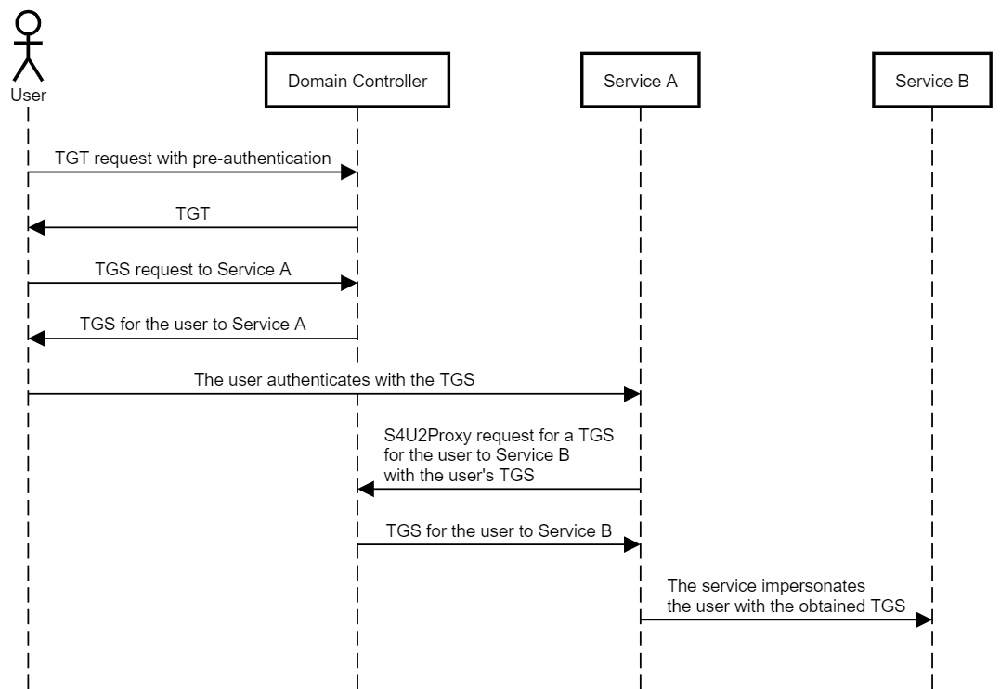
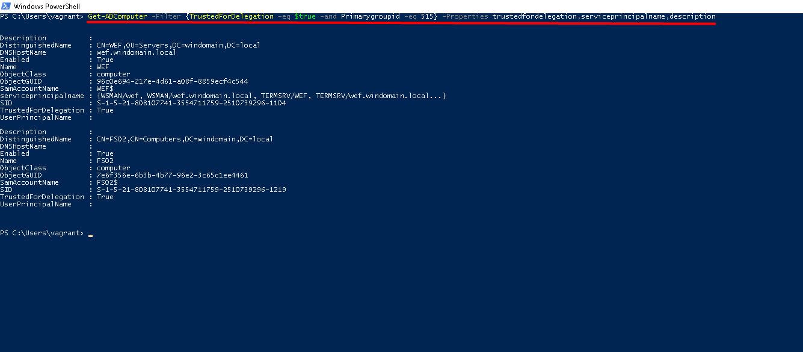
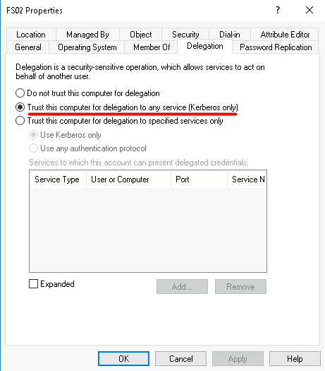
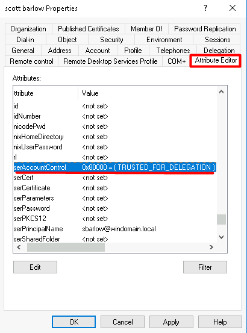
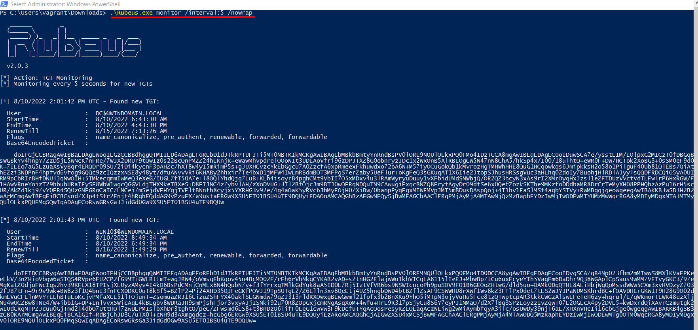
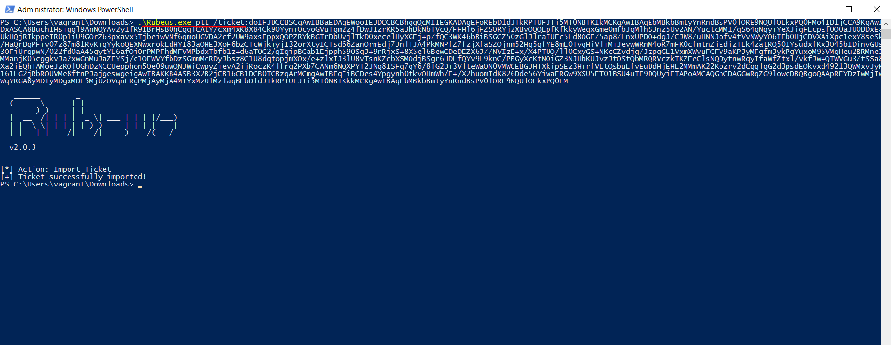
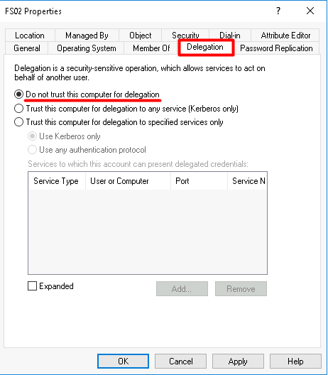

# TTP 0x3 - UnConstrained Delegation

| Metric  | Value  |
|---------|--------|
| Severity                      | `High` |
| Ease of Identification        | `Easy` |
| Ease of Mitigation            | `Medium` |
| Ease of Detection             | `High` |
| Ease of Deception             | `Easy` |
| MITRE ATT&CK Tactic           | `` |
| MITRE ATT&CK Technique        | `` |
| MITRE ATT&CK Sub-Technique    | `` |
| MITRE ATT&CK ID               | `` |
| APT Groups                    | ``|
| Target                        | `Kerberos Protocol` |
| Tools                         | `Rubeus`, `PrinterBug`, `Mimikatz` |
| Privilege Before Exploitation | `Service account` or  `Network Access` or `Network sniffing` |
| Privilege After Exploitation  | `Service account` or `Privileged Service account` |
| Version                       | 0.1 |
| Date                          | 11.08.2022 |

## Preliminary

Kerberos, güvenli olmayan ağlar üzerinde bilet (ticket) olarak adlandırılan veri paketlerini kullanarak kimlik doğrulama (authentication) işlemlerini gerçekleştiren bir protokoldür. UDP ve TCP protokollerini kullanmakta ve 88 numaralı port üzerinde çalışmaktadır.  

Active Directory altyapısı 

1.	KDC (Key Distribution Center): Kerberos protokolününde kimlik doğrulama, biletlerin üretilmesi ve doğrulanması gibi işlevleri gerçekleştiren servistir.

2.	İstemci (Client): Servise erişmek için kimlik doğrulama sürecini başlatan objedir.

3.	Uygulama (Application/Servis): İstemcinin kimlik doğrulama sonucunda erişmek istediği servistir.


Kerberos Double Hop sorunu ile birlikte ortaya delegasyon tanımları çıkmıştır. 


### Kerberos Double Hop

Kerberos protokölü doğası gereği sunucu kendisine erişen istemcinin kimlik bilgileri ile başka sunuculara erişmesini engellemektedir. Microsoft bu durum üzerine çeşitli delegasyon tanımlama yöntemleri geliştirmişir. 

-   UnConstrained Delegation(Kısıtlamasız Delegasyon)
-   Constrained Delegation(Kısıtlanmış Delegasyon)
-   Resource Based Constrained Delegation(Kaynak Tabanlı Kısıtlanmış Delegasyon)

### UnConstrained Delegation(Kısıtlamasız Delegasyon)

Microsoft, Windows 2000 ile birlikte Kerberos UnConstrained Delegation(Kısıtlamasız Delegasyon) yöntemini ortaya koymuştur. Bu yöntem ile birlikte sunucu kendisine erişen istemcileri taklit ederek kısıtlamasız bir şekilde Aktive Direktory ortamındaki tüm servislere erişebilmektedir. 
Bu işlemi gerçekleştirebilmesi için sunucu elinde, istemcinin TGT biletini bulundurması gerekir. Sunucu bu TGT biletini kullanarak KDC den ST bileti talebinde bulunabilir. Bu şekilde gelen Servis biletleri ile başka sunucularla iletişime geçebilir. 




## Description

Active Directory ortamında UnConstrained Delegation(Kısıtlamasız Delegasyon) yöntemi, sunucular istemcilerin kimlik bilgileriyle tüm servislere erişim sağlayabilmesi için aktif edilebilmektedir. Delegasyon tanımlamaları ile birlikte sunucular ortamdaki servislere erişim sağlayabilmektedir. 

UnConstrained Delegation(Kısıtlamasız Delegasyon) ayarı aktif edildiğinde objenin UserAccountControl değerine 0x80000 hex değeri eklenmektedir.

## Impact

Bir sunucu üzerinde UnConstrained Delegation(Kısıtlamasız Delegasyon) objesi aktif edilmesi sonucunda, saldırgan bu sunucuya erişmesi halinde sunucu üzerinde bulunan TGT biletleri ile Servislere erişmek için bilet talebinde bulunabilir. Elde ettiği biletlerle domaindeki tüm servislere erişebilme yetkisine sahip olabilir. Bu şekilde domainde daha tehlikeli olabilecek hareketler sergilemeye devam edebilir.

## Identification

UnConstrained Delegation(Kısıtlamasız Delegasyon) objesi aktif edilmiş kullanıcılar ve bilgisayarların tespiti için aşağıdaki Powershell betikleri kullanılabilmektedir. 
 
**Not:** Get-ADUser ve Get-ADComputer cmdletleri Powershell ActiveDirectory modülü içerisinde bulunmaktadır. Bu nedenle eğer komut Domain Controller dışında çalıştırılacaksa, bu modül manuel olarak yüklenmelidir.

```Powershell
#UnConstrained Delegation(Kısıtlamasız Delegasyon) aktif edilmiş bilgisayarları getirilmesi
Get-ADComputer -Filter {TrustedForDelegation -eq $true -and Primarygroupid -eq 515} -Properties trustfordelegation,serviceprincipalname,description
```

```Powershell
#UnConstrained Delegation(Kısıtlamasız Delegasyon) aktif edilmiş kullanıcıların getirilmesi
Get-ADUser -Filter {TrustedForDelegation -eq $true -and Primarygroupid -eq 513} -Properties trustfordelegation,serviceprincipalname,description
```



UnConstrained Delegation(Kısıtlamasız Delegasyon) aktif edilmiş objeleri manuel olarak **Active Directory Users and Computers (dsa.msc)** aracı ile tespit edilebilmektedir(Kullanıcılarda bu işlem Attribute Editor üzerinden gerçekleştirilir). Bunun için uygulama üzerinden objenin detay sayfası (Properties) açılır. **Delegation** sekmesi içerisindeki, **"Trust this computer for delegation to any service(Kerberos only)"** kutucuğu işaretli ise UnConstrained Delegation özelliği aktif edilmiştir.



Zafiyet ayrıca **Attribute Editor** sekmesi üzerinden **UserAccountControl** değeri analiz edilerek de tespit edilebilmektedir. Eğer bu değer içerisinde **TRUSTED_FOR_DELEGATION** ibaresi yer alıyorsa, objenin zafiyetli olduğu anlaşılmaktadır.



## Exploitation

UnConstrained Delegation(Kısıtlamasız Delegasyon) saldırısı Rubeus, PrinterBug, Mimikatz ve farklı araçlarla gerçekleştirilebilmektedir. Aşağıdaki komut ile Rubeus monitor modda çalıştırılmaktadır. Monitor modda sunucu üzerine gelen TGT leri rahat bir şekilde görebilmekteyiz.  

```powershell
Rubeus.exe monitor /interval:5 /nowrap
```



Elde ettiğimiz yetkili bir kullanıcı TGT bileti ile bağlanacağımız servis için ST(Servis Bileti) isteğinde bulunabiliriz. Elde ettiğimiz ticket rubeus ile inject edilerek erişmek istediğimiz sunucu için arka tarafta otomatik ST isteğinde bulunmasını sağlarız. Bu şekilde servise rahatlıkla erişebiliriz.

```powershell
Rubeus.exe ptt /ticket:<TGT>
```



## Mitigation

1. Zafiyetli objeler tespit edildikten sonra bu objelerin kullanıldığı senaryolar ve uygulamalar incelenmelidir. Eğer uygulamalar UnConstrained Delegation özelliği aktif ise aşağıdaki adımlar uygulanarak UnConstrained Delegation devre dışı bırakılmalıdır.

    a. Aşağıdaki Powershell betikleri kullanılarak kullanıcılar ve bilgisayarlar üzerinde Pre-Authentication otomatize bir şekilde aktif edilebilmektedir.

    ```powershell
    # UnConstrained Delegation(Kısıtlamasız Delegasyon) özelliği kullanıcılar için devre dışı bırakılması
    Get-ADUser -Filter * -Properties TrustedForDelegation |
    Where-Object {$_.TrustedForDelegation -eq $true} |
    Set-ADAccountControl -TrustedForDelegation $false 
    ```

    ```powershell
    # UnConstrained Delegation(Kısıtlamasız Delegasyon) özelliği bilgisayarlar için devre dışı bırakılması
    Get-ADComputer -Filter * -Properties TrustedForDelegation |
    Where-Object {$_.TrustedForDelegation -eq $true} |
    Set-ADAccountControl -TrustedForDelegation $false 
    ```

    **Not:** Bu betiklerle tüm zafiyetli objeler üzerinde değişiklik otomatize bir şekilde gerçekleştirilmektedir. Eğer ortamdaki servislerin gereksinimleri doğru analiz edilmemişse bu işlem kesintilere sebep olabilmektedir. Bu gibi kesintilerin yaşanmaması için giderme işlemi **Filter** veya **Identity** parametreleri kullanılarak tekil bir şekilde de gerçekleştirebilmektedir.

    ```powershell
    # Pre-Authentication özelliğinin tekil olarak devre dışı bırakılması
    Get-ADUser -Identity <object_samaccountname> -Properties TrustedForDelegation |
    Where-Object {$_.TrustedForDelegation -eq $true} |
    Set-ADAccountControl -TrustedForDelegation $false 
    ```

    b. Zafiyeti giderme işlemi **Active Directory Users and Computers (dsa.msc)** aracı ile manuel olarak da gerçekleştirilebilmektedir. Bunun için uygulama üzerinden objenin detay sayfası (Properties) açılır. **Account** sekmesi içerisindeki, **Account options** kısmındaki **"Do Not require Kerberos preauthentication"** kutucuğundaki işaret kaldırılarak zafiyet giderilebilmektedir.

    

2. Aşağıdaki işlemler uygulanarak hesaplarımızı daha güvenli hale getiebiliriz.
    
    a. Zafiyetli objeler için manuel olarak Active Directory Users and Computers (dsa.msc) aracı ile güvenli hale getirebilmektedir. Bunun için uygulama üzerinden objenin detay sayfası (Properties) açılır. Account sekmesi içerisindeki, Account options kısmındaki "Account is sensivite and connot be delegated(Hesap hassastır ve devredilemez)" kutucuğunu işaretleyerek delegasyon tanımlamalarını devre dışı bırakmış oluruz.

    

    b. Zafiyet ayrıca **Attribute Editor** sekmesi üzerinden **UserAccountControl** değeri analiz edilerek de tespit edilebilmektedir. Eğer bu değer içerisinde **NOT_DELEGATED** ibaresi yer alıyorsa, obje üzerinde delegasyon tanımları geçersiz sayılacaktır.Zafiyetli objeler detaylı bir şekilde monitör edilmeli ve normalin dışındaki aksiyonların tespit edilerek gerekli güvenlik opsiyonları sağlanmalıdır.

3. Kullanıcıları delegasyon saldırılarından korumak bir başka yöntem ise "Korumalı kullanıcılar" grubuna eklemektir. Korumalı kullanıcılar grubundaki hesaplar için yetkilendirmeye izin verilmemektedir. Bu şekilde hesaplarınızı daha güvenli hale getirmiş olursunuz.
 
## Detection

UnConstrained Delegation(Kısıtlamasız Delegasyon) saldırısının farklı fazlarda tespiti için aşağıdaki Event ID bilgileri ve Sigma kuralları incelenmeli ve kurum bünyesinde tespit teknolojileri üzerinde uygulanmalıdır.

| Event Id  | Title | Description |
|---------|--------|--------|
| 4738 | `A user account was changed.` | Kullanıcılarda UnConstrained Delegation ayarının aktif edilmesi tespit edilebilmektedir. |
| 4742 | `A computer account was changed.` | Bilgisayarlarda UnConstrained Delegation ayarının aktif edilmesi tespit edilebilmektedir. |
| 4662 | `An operation was performed on an object.` | Objelerin userAccountControl değeri üzerinde yapılan okumalar tespit edilebilmektedir. |
| 4769 | `A Kerberos service ticket was requested.` | Kerberos TGT istekleri tespit edilebilmektedir. |
| 5136 | `A directory service object was modified.` | Objelerin userAccountControl değeri üzerinde yapılan yazma işlemleri tespit edilebilmektedir. |

| Rule Id  | Title | TTP | Stage | Source | Event Id |
|---------|--------|--------|--------|--------|--------|
| 0x1 | [UserAccountControl Attribute Modification](detection-rules/Rule%200x1%20-%20Pre-Authentication%20Disabled%20on%20Computer%20Account.yaml) | `Multiple` | `Vulnerability`, `Persistence` | Security | 5136 |
| 0x2 | [Trusted for Delegation  Enabled on User Account](detection-rules/Rule%200x2%20-%20Pre-Authentication%20Disabled%20on%20User%20Account.yaml) | `UnConstrained Delegation` |`Vulnerability`, `Persistence` | Security | 4738 |
| 0x3 | [Trusted for Delegation  Enabled on Computer Account](detection-rules/Rule%200x3%20-%20UserAccountControl%20Attribute%20Enumeration.yaml) | `Multiple` | `Vulnerability`, `Persistence` | Security | 4742 |
| 0x4 | [Kerberos TGT Request for Uncontrained Delegation](detection-rules/Rule%200x4%20-%20Kerberos%20TGT%20Request%20without%20Pre-Authentication.yaml) | `UnConstrained Delegation` | `Exploitation` | Security | 4769 |
| 0x5 | [UserAccountControl Attribute Enumeration](detection-rules/Rule%200x5%20-%20Kerberos%20TGT%20Request%20with%20RC4%20Encryption.yaml) | `Multiple` | `Enumeration` | Security | 4662 |


## References

- https://posts.specterops.io/hunting-in-active-directory-unConstrained-delegation-forests-trusts-71f2b33688e1
- https://medium.com/r3d-buck3t/attacking-kerberos-unConstrained-delegation-ef77e1fb7203
- https://blog.netwrix.com/2021/11/30/what-is-kerberos-delegation-an-overview-of-kerberos-delegation/
- https://posts.specterops.io/kerberosity-killed-the-domain-an-offensive-kerberos-overview-eb04b1402c61
- https://adsecurity.org/?p=1667
- https://docs.microsoft.com/en-us/windows/security/threat-protection/auditing/event-4769
- https://docs.microsoft.com/en-us/windows/security/threat-protection/auditing/event-4738
- https://docs.microsoft.com/en-us/windows/security/threat-protection/auditing/event-4742
- https://docs.microsoft.com/en-us/windows/security/threat-protection/auditing/event-4662
- https://docs.microsoft.com/en-us/windows/security/threat-protection/auditing/event-5136

## Authors

- Serdal Tarkan Altun