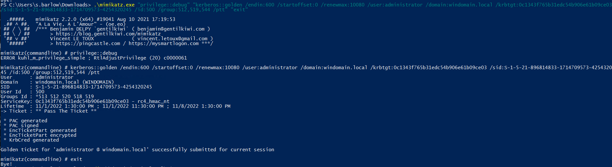
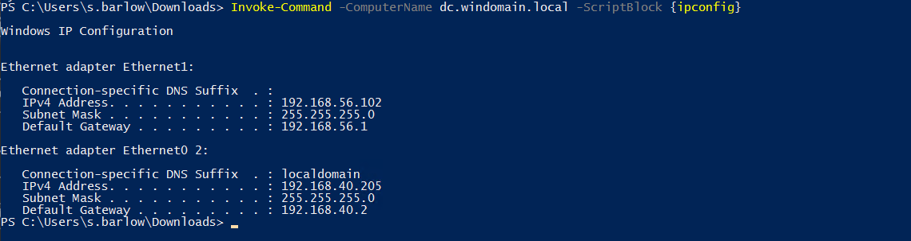

# TTP 0x7 - Golden Ticket (Altın Bilet)

| Metric  | Value  |
|---------|--------|
| Severity                      | `Critical` |
| Ease of Identification        | `N/A` |
| Ease of Mitigation            | `Medium` |
| Ease of Detection             | `Hard` |
| Ease of Deception             | `Easy` |
| MITRE ATT&CK Tactic           | `Credential Access` |
| MITRE ATT&CK Technique        | `Steal or Forge Kerberos Tickets` |
| MITRE ATT&CK Sub-Technique    | `Golden Ticket` |
| MITRE ATT&CK ID               | `T1558.001` |
| APT Groups                    | `N/A`|
| Target                        | `Kerberos Protocol` |
| Tools                         | `Mimikatz` |
| Privilege Before Exploitation | `Domain account` or `Network sniffing` |
| Privilege After Exploitation  | `Domain account` or `Privileged Domain account` |
| Version                       | 0.1 |
| Date                          | 1.11.2022 |

## Preliminary

Kerberos, güvenli olmayan ağlar üzerinde bilet (ticket) olarak adlandırılan veri paketlerini kullanarak kimlik doğrulama (authentication) işlemlerini gerçekleştiren bir protokoldür. UDP ve TCP protokollerini kullanmakta ve 88 numaralı port üzerinde çalışmaktadır.  

Active Directory altyapısı 

1.	KDC (Key Distribution Center): Kerberos protokolününde kimlik doğrulama, biletlerin üretilmesi ve doğrulanması gibi işlevleri gerçekleştiren servistir.

2.	İstemci (Client): Servise erişmek için kimlik doğrulama sürecini başlatan objedir.

3.	Uygulama (Application/Servis): İstemcinin kimlik doğrulama sonucunda erişmek istediği servistir.

Krbtgt hesap parola özetinin ele geçirilmesiyle domain ortamında ki herhangi bir kullanıcı veya servis için TGT üretilebilmektedir. Üretilen bilete Golden Ticket adı verilmektedir.


Altın Bileti oluşturabilmek için elimizde krbtgt parola özeti, taklit edilecek kullanıcı adı (Impersonate), kullanıcı id değeri ve domain sid değeri yeterli olmaktadır.

## Description

Krbtgt parola özetinin ele geçirilmesiyle altın bileti domainde olmayan bir bilgisayar üzerinde ve domaine ait olmayan kullanıcı adı ile oluşturulabilmektedir. Oluşturulan Altın biletler ST (TGS-REQ) isteklerinde kullanılarak servislere erişimi sağlanabilmektedir. 

## Impact

Saldırgan sistem üzerinden krbtgt parola özetini ele geçirdikten sonra domaine ekli kullanıcı ve domainde ekli olmayan bütün kullanıcılar için bilet oluşturabilmektedir. Bu oluştuduğu biletler ile Domain Controler'a erişim sağlayarak domain üzerinde bütün yetkiyi ele geçirebilmektedir. 


## Exploitation

Saldırı senaryosunda krbtgt parola özetinin ele geçirildiği varsayılmaktadır. Altın bilet saldırısı  mimikatz ve rubeus gibi farklı araçlarla yapılabilmektedir. Mimikatz aracı ile Altın Bilet(TGT)  oluştururken gerekli bilgileri vererek bileti oluşturabiliriz.

**Not:** Mimikatz aracına gerekli parametreler verilerek çalıştırılmaktadır.

| Command | Description |
|---------|--------|
| `/kerberos::golden` | Saldırı parametresi |
| `/user` | Taklit edilecek kullanıcı |
| `/domain` | Domain adı (FQDN) |
| `/Endin` | Bilet süresi belirler |
| `/Startoffset` | Başlangıç ofset belirlenir (Geçmiş negatif gelecek pozitif şimdi ise 0 değeri verilerek ayarlanır) |
| `/renewmax ` | Max süre belirleme |
| `/aes256(krbtgt,aes128)` | Krbtgt parolası girilir |
| `/SID` | Domain sid değeri girilir |
| `/SIDS` | Genellikle SIDHistory ataklarında kullanılır grup sid değeri eklenir |
| `/id` | Kullanıcı kimliği (Administrator 500) |
| `/groups` | grup sid (512:Domain Admin, 513:Admin User, 519: Enterprise Admins, 544: Administartors)
| `/ptt` | Komut inject (Pass The Ticket) |

```powershell
# Altın Bilet oluşturma
Mimikatz.exe "privilege::debug" "kerberos::golden /endin:600 /startoffset:0 /renewmax:10080 /user:administrator /domain: /sid: /id: /group: /ptt" "exit"
```


Uzak sistemde powershell ile komut çalıştırma işlemi gerçekleştiriliyor.

```powershell
# DC üzerinde komut çalıştırma
Invoke-Command -ComputerName dc.windomain.local -ScriptBlock {ipconfig}
```


## Mitigation

1. Sunuculara ve servislere erişimler kısıtlanarak saldırganların sistem üzerinde ayrıcalıklar elde etmesi engellenebilir. Ayrıca yetki verilmiş kullanıcılar kontrol edilmeli ve gereksiz yetkilendirme yapılmamalıdır. Bu şekilde ntds.dit erişimi kısıtlanarak krbtgt parola özetlerine ulaşım zorlaştırılabilir. 

2. 
    a) Krbtgt ve diğer servis hesaplarının parolaları düzenli aralıklarla değiştirilmelidir.

    b) Krbtgt hesabı mevcut parolanın yanı sıra eski parolayıda saklamaktadır. Bu işlemi önceden oluşturulan biletlerin kontrolünü sağlayabilmek adına yapmaktadır. Krbtgt parola özetleri değişitirilirken üst üste 2 kez değiştirilerek önceki parolaların geçerliliği de sonlandırılmalıdır. Microsoft'un geliştirmiş olduğu özel script ile bu işlemi gerçekleştirebilirsiniz.

3. PAC (Privilaged Attribute Certificate), biletin temsil ettiği ayrıcalıkların listesini ve diğer bazı bilgileri tutmaktadır. PAC verisi krbtgt'nin parola özeti ile imzalanmaktadır. KDC den servis erişim bileti talebinde bulunulduğu sırada TGT den TGS biletine kopyalanmaktadır. Microsoft yeni güncelleme ile toplamda 2 farklı PAC doğrulama işlemi gerçekleştirir. Her 2 doğrulamada bilet 20 dakikadan daha eskiyse çalışmaktadır. Bu yöntemlerde Windows işletim sisteminin bir parçası olarak atanan (SeTcbPrivilege) kullanıcılarının bilet isteklerinde PAC kontrolü yapılmamaktadır.
    
    a) Eski PAC doğrulama yöntemi varsayılan ayarlarda devre dışıdır. Bu yöntemde ST bileti içerisinde bulunan PAC alanı, servisin çalıştığı sunucu (Lsass processi) tarafından DC'nin Netlogon servisine NRPC protokolü ile gönderilerek doğrulanmaktadır. PAC doğrulaması HKLM\SYSTEM\CurrentControlSet\Control\Lsa\Kerberos\Parameters kayıt defteri anahtarına (Registry key) giderek burada bulunan ValidateKdcPacSignature ayarı değiştirilerek yapılmaktadır. 
    
    | ValidateKdcPacSignature | Value |
    |---------|--------|
    | 0 | Enable |
    | 1 | Disable |

    b) Yeni PAC doğrulama yönteminde ise KB5008380 numaralı güncelleme ile PAC içerisine PAC_REQUESTOR isimli bir alan eklenmiştir. Bu yeni eklenen alan kullanıcının SID değerini barındırmaktadır. PAC doğrulama TGS-REQ aşamasında kullanıcı adı ve SID değeri karşılaştırılarak yapılmaktadır. Bu yeni güncelleme HKEY_LOCAL_MACHINE\System\CurrentControlSet\Services\Kdc kayıt defteri anahtarına (Registry key) giderek burada bulunan PACRequestorEnforcement alanına bakarak aktifliği kontrol edilebilir.

    | PACRequestorEnforcement | Description |
    |---------|--------|
    | 0 (Disabled) | `The validation is disabled. Old PAC may be used.` |
    | 1 (Enabled) | `Both old and new PAC may be used. If new structure PAC is used, the requestor is validated.` |
    | 2 (Enforced) | `Authentication with old PAC is denied. The user requestor value is validated.` |

Windows işletim sisteminin bir parçası olarak atanan (SeTcbPrivilege) kullanıcıların bilet isteklerinde PAC kontrolü yapılmamaktadır.  Golden Ticket saldırısında bilet oluşturulurken PAC'a müdahale edilerek sahte hesaplar ve kullanıcı farklı gruplara üyü gibi gösterilebilmektedir. KB5008380 numaralı güncelleme ile PAC içerisine PAC_REQUESTOR isimli bir alan eklenmiştir. Kerberos TGS-REQ aşamasında sadece bilet 20 dakikadan daha eskiyse hesap adı ve SID kontrolü yapmaktadır. 

4. Domain Controlerdan TGT bileti almadan yapılan TGS istekleri kontrol edilebilir. 

5. Active Directory ortamındaki herhangi bir sistem üzerinde önbelleğe alınmış biletler üzerinde karşılaştırama yaparak zaman değeri normal olmayan(Altın bilet) biletler tespit edilebilmektedir. Bu script şüpheli makina üzerinde çalıştırılarak azaltma işlemlerinde fayda sağlayabilmektedir. (Makina üzerinde Active Directory cmdlet yüklü olması gerekiyor) 

## Detection

Golden Ticket saldırısının farklı fazlarda tespiti için aşağıdaki Event ID bilgileri ve Sigma kuralları incelenmeli ve kurum bünyesinde tespit teknolojileri üzerinde uygulanmalıdır.

| Event Id  | Title | Description |
|---------|--------|--------|
| 4624 | `An account was successfully logged on.` | Kullanıcıların Altın biletle servisler üzerindeki oturum açma işlemi tespit edilebilmektedir. |
| 4672 | `Special privileges assigned to new logon.` | Kullanıcıların oturum açma ayrıcalıkları kontrol edilerek ayrıcalık atanmış kullanıcılar tespit edilebilmektedir. |
| 4627 | `Group membership information.` | Kullanıcı grup üyelikleri kontrol edilerek tespit edilebilmektedir. |
| 4769 | `A Kerberos service ticket was requested.` | Kerberos TGS istekleri ve şifreleme türleri tespit edilebilmektedir. |
| 35 | `PAC without Attributes. The new PAC_ATTRIBUTE_INFO structure was not present in the PAC.` | PAC içerisinden PAC_ATTRIBUTE_INFO yapısı olmadığında oluşur. |
| 36 | `Ticket without a PAC. A service ticket was requested but no PAC was present.` | Bilet içerisinden PAC olmadığında oluşur. |
| 37 | `Ticket without requestor. The KDC encountered ticket without PAC_REQUESTOR while requesting service ticket.` | KDC, hizmet bileti isterken PAC_REQUESTOR olmayan biletle karşılaştığında oluşur. |
| 38 | `Requestor mismatch. The PAC_REQUESTOR_SID does not match what was resolved from the username.` | PAC_REQUESTOR_SID, kullanıcı adından çözümlenenle eşleşmediğinde oluşur. |


| Rule Id  | Title | TTP | Stage | Source | Event Id |
|---------|--------|--------|--------|--------|--------|
| 0x1 | [Security ID Control on User Account Logon](detection-rules/Rule%200x1%20-%20Security%20ID%20Control%20on%20User%20Account%20Logon.yaml) | `Golden Ticket` | `Exploitation` | Security | 4624 |
| 0x2 | [Security ID Control on Group Membership](detection-rules/Rule%200x2%20-%20Security%20ID%20Control%20on%20Group%20Membership.yaml) | `Golden Ticket` | `Exploitation` | Security | 4627 |
| 0x3 | [User Account Logon Without Domain Value](detection-rules/Rule%200x3%20-%20User%20Account%20Logon%20Without%20Domain%20Value.yaml) | `Golden Ticket` | `Exploitation` | Security | 4624 |
| 0x4 | [User Account Logon Without Domain FQDN](detection-rules/Rule%200x4%20-%20User%20Account%20Logon%20Without%20Domain%20FQDN.yaml) | `Golden Ticket` | `Exploitation` | Security | 4624 |
| 0x5 | [Security ID Control on Administrator Account](detection-rules/Rule%200x4%20-%20User%20Account%20Logon%20Without%20Domain%20FQDN.yaml) | `Golden Ticket` | `Exploitation` | Security | 4672 |
| 0x6 | [Group ID Control on Group Membership](detection-rules/Rule%200x6%20-%20Group%20ID%20Control%20on%20Group%20Membership.yaml) | `Golden Ticket` | `Exploitation` | Security | 4627 |
| 0x7 | [Kerberos ST Request with RC4 Encryption](detection-rules/Rule%200x4%20-%20Kerberos%20ST%20Request%20with%20RC4%20Encryption.yaml) | `Golden Ticket` | `Exploitation` | Security | 4769 |


## References

- https://learn.microsoft.com/tr-tr/archive/blogs/openspecification/understanding-microsoft-kerberos-pac-validation
- https://support.microsoft.com/en-gb/topic/kb5008380-authentication-updates-cve-2021-42287-9dafac11-e0d0-4cb8-959a-143bd0201041
- https://attack.mitre.org/techniques/T1558/001/
- https://docs.microsoft.com/en-us/windows/security/threat-protection/auditing/event-4769
- https://docs.microsoft.com/en-us/windows/security/threat-protection/auditing/event-4624
- https://docs.microsoft.com/en-us/windows/security/threat-protection/auditing/event-4672
- https://docs.microsoft.com/en-us/windows/security/threat-protection/auditing/event-4627
- https://www.varonis.com/blog/pac_requestor-and-golden-ticket-attacks
- https://www.varonis.com/blog/kerberos-how-to-stop-golden-tickets?hsLang=en
- https://posts.specterops.io/kerberosity-killed-the-domain-an-offensive-kerberos-overview-eb04b1402c61
- https://dirteam.com/sander/2021/11/16/you-may-encounter-authentication-issues-after-installing-the-november-2021-cumulative-updates/
- https://github.com/microsoft/New-KrbtgtKeys.ps1 #(Krbtgt reset script)
- https://gist.github.com/mubix/fd0c89ec021f70023695#file-reset-krbtgtkeyinteractive-ps1 #(Krbtgt reset script)
- https://www.netwrix.com/how_golden_ticket_attack_works.html
- https://blog.netwrix.com/2022/01/10/pacrequestorenforcement-and-kerberos-authentication/
- http://passing-the-hash.blogspot.com/2014/09/pac-validation-20-minute-rule-and.html
- https://adsecurity.org/?p=660
- https://adsecurity.org/?p=2495
- https://adsecurity.org/?p=1640
- https://adsecurity.org/?p=1515
- https://adsecurity.org/?p=1640
- https://adsecurity.org/?p=2011
- https://adsecurity.org/?p=676
- https://stealthbits.com/blog/what-is-the-kerberos-pac/
- https://www.thehacker.recipes/ad/movement/kerberos/forged-tickets/golden
- https://github.com/gentilkiwi/kekeo/wiki/ms14068
- https://github.com/SecWiki/windows-kernel-exploits/tree/master/MS14-068/pykek
- https://www.ired.team/offensive-security-experiments/active-directory-kerberos-abuse/kerberos-golden-tickets
- https://www.splunk.com/en_us/blog/security/detecting-active-directory-kerberos-attacks-threat-research-release-march-2022.html
- https://jpcertcc.github.io/ToolAnalysisResultSheet/details/Mimikatz_GoldenTicket.htm
- https://github.com/ThreatHuntingProject/ThreatHunting/blob/master/hunts/golden_ticket.md #(Local makinede script çalıştırarak tespit)
- https://github.com/spohara79/TGT---Golden-Silver-Ticket
- https://cyberstruggle.org/microsoft-ata-evasion-overpth-golden-ticket/
- https://justanothergeek.chdir.org/2021/07/detecting-golden-ticket-attacks/
- https://www.socinvestigation.com/detecting-and-preventing-a-golden-ticket-attack/

## Authors

- Serdal Tarkan Altun
- Furkan Özer