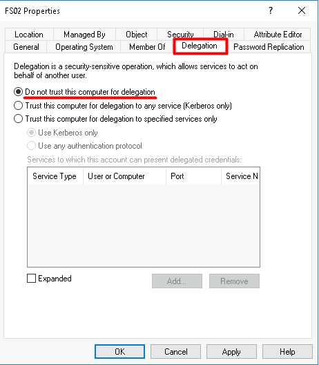
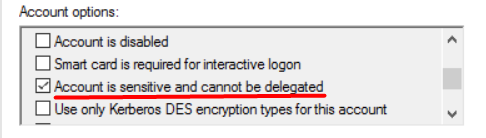

# TTP 0x4 - Constrained Delegation (Kerberos Only - S4U2Proxy)

| Metric  | Value  |
|---------|--------|
| Severity                      | `High` |
| Ease of Identification        | `Easy` |
| Ease of Mitigation            | `Medium` |
| Ease of Detection             | `Hard` |
| Ease of Deception             | `Easy` |
| MITRE ATT&CK Tactic           | `Credential Access` |
| MITRE ATT&CK Technique        | `Steal or Forge Kerberos Tickets` |
| MITRE ATT&CK Sub-Technique    | `N/A` |
| MITRE ATT&CK ID               | `T1558` |
| APT Groups                    | `N/A` |
| Target                        | `Kerberos Protocol` |
| Tools                         | `Rubeus`, `Impacket` |
| Privilege Before Exploitation | `Constrained Delegation (S4U2Proxy) Enabled Object` |
| Privilege After Exploitation  | `Privileged Domain Account` |
| Version                       | 0.1 |
| Date                          | 22.08.2022 |

## Preliminary

Kerberos, güvenli olmayan ağlar üzerinde bilet (ticket) olarak adlandırılan veri paketlerini kullanarak kimlik doğrulama (authentication) işlemlerini gerçekleştiren bir protokoldür. UDP ve TCP protokollerini kullanmakta ve 88 numaralı port üzerinde çalışmaktadır.

Active Directory altyapısı ana kimlik doğrulama protokolü olarak Kerberos kullanmaktadır. Kerberos protokolü iletişimi üç taraf arasında gerçekleştirilmektedir.

1.	KDC (Key Distribution Center): Kerberos protokolününde kimlik doğrulama, biletlerin üretilmesi ve doğrulanması gibi işlevleri gerçekleştiren servistir.

2.	İstemci (Client): Servise erişmek için kimlik doğrulama sürecini başlatan objedir.

3.	Uygulama (Application/Servis): İstemcinin kimlik doğrulama sonucunda erişmek istediği servistir.

### Kerberos Double Hop

Kerberos protokolünün doğası gereği uygulama kendisine erişen istemcinin kimlik bilgileri ile başka sunuculara erişmesine izin vermemektedir. Bu durum uygulamanın kendisine iletilen ST (Service Ticket) ile diğer servis için istemciye ait farklı bir bilet üretememesinden kaynaklanmaktadır. Bu durum Kerberos Double Hop problemi olarak adlandırılmaktadır. Microsoft bu problemi çözmek için Kerberos protokolünü çeşitli delegasyon yöntemleri ile geliştirmişir.

-   Unconstrained Delegation (Kısıtlamasız Delegasyon)
-   Constrained Delegation 
-   Resource Based Constrained Delegation (Kaynak Tabanlı Kısıtlanmış Delegasyon)

### Constrained Delegation 

Microsoft, Windows Server 2003 ile birlikte Kerberos Constrained Delegation yöntemini ortaya koymuştur. Bu yöntem sayesinde delegasyon tanımlanan sunucu kendisine erişen objeleri (kullanıcı, bilgisayar vb) Active Directory ortamındaki ön tanımlı (predefined) servislere erişirken taklit (impersonate) edebilmektedir. 

Constrained Delegation yöntemi kullanılan protokole göre ikiye ayrılmaktadır.

-   Kerberos Protokolü (S4U2Proxy)
-   Tüm Kimlik Doğrulama Protokolleri (S4U2Self)

### S4U2Proxy 

Bir sunucu üzerinde bu delegasyon tanımlandığında, bu sunucuya **Kerberos Protokolü** erişen objeler, sunucuya Forwardable ST (Service Ticket/TGS) biletini iletirler (Adım 1). Bu sayede sunucu ST biletini kullanarak delegasyonda tanımlanmış servislere erişebilecek yeni ST biletini, S4U2Proxy isteği ile Domain Controller sunucusundan alabilmektedir  (Adım 2,3). Sonuç olarak S4U2Proxy isteği ile elde edilen ST bileti sayesinde diğer sunucuya/servise erişim Kerberos protokolü ile sağlanmış olur ve bu sayede de Double Hop problemi çözülmüş olur (Adım 4).


## Description

Active Directory ortamında Constrained Delegation yöntemi, sunucuların istemcilerin kimlik bilgileriyle diğer servislere erişim sağlayabilmesi ve Double Hop probleminin çözülebilmesi için aktif edilebilmektedir. S4U2Proxy isteği ise Kerberos protokölü kullanılarak sunucu objesi üzerinde tanımlanmış servislere, istemcilerin kimlik bilgileriyle erişim sağlanabilmektedir.

Constrained Delegation değerinin aktif edilebilmesi için hedef sunucuda erişilecek servisler (SPN) de belirtilmelidir. Bu servisler belirlenerek kayıt edildiği anda objenin **msDS-AllowToDelegateTo** değerine kayıtlar eklenmektedir.

## Impact

Constrained Delegation (S4U2Proxy) tanımlı obje kendisine erişen istemcilerin Forwardable olarak işaretlenmiş ST biletiğini aldığı için bu ST bileti ile ön tanımlı olan servislere erişmek için istemciyi taklit edebilmektedir. Bu nedenle eğer saldıgran bu objeyi (kullanıcı veya sunucu) ele geçirebilirse erişim sağlayan tüm istemcilerin ST biletlerini elde ederek ön tanımlı servislere erişim sağlayabilecektir. Eğer bu sunucuya yetkili bir kullanıcı erişirse saldırgan bu hesaba ait servis biletini kullanarak yetki yükseltme işlemi de gerçekleştirebilmektedir.

**Not:** Kerberos biletlerindeki SPN değeri açık metin (plain-text) olarak iletildiğinden bu değerler üzerindeki değişiklikler biletin bütünlüğünü (integrity) bozmadan gerçekleştirilebilmektedir. Bu şekilde de Constrained Delegation yöntemindeki servis kısıtı devre dışı bırakılabilmektedir. Sonuç olarak elde edilen ST bileti ön tanımlı sunucudaki tüm servisler için kullanılabilmektedir.

**Not:** S4U2Proxy sürecinin çalışabilmesi için Forwardable olarak işaretlenmiş ST bileti gerekmektedir. Eğer saldırganın ele geçirdiği sunucuya hiç bir istemci erişmezse herhangi bir iletilmeyecek saldırgan da hiçbir bileti ele geçiremeyecektir. Bu aşamada saldırgan ele geçirdiği obje üzerinde Resource Based Constrained Delegation (RBCD) tanımlaması yaparak Forwardable ST bileti üretebilmektedir. Bu sayede de sunucuya herhangi bir objenin erişmesine gerek kalmamaktadır.

## Identification

Constrained Delegation (S4U2Proxy) aktif edilmiş kullanıcı ve bilgisayar heplarının tespiti için aşağıdaki Powershell betikleri kullanılabilmektedir. 
 
**Not:** Get-ADUser ve Get-ADComputer cmdletleri Powershell ActiveDirectory modülü içerisinde bulunmaktadır. Bu nedenle eğer komut Domain Controller dışında çalıştırılacaksa, bu modül manuel olarak yüklenmelidir.

```powershell
# Constrained Delegation (S4U2Proxy) aktif edilmiş bilgisayarların tespiti
Get-ADComputer -Filter 'msDS-AllowedToDelegateTo -ne "$null"' -Properties msDS-AllowedToDelegateTo
```

```powershell
# Constrained Delegation (S4U2Proxy) aktif edilmiş kullanıcıların tespiti
Get-ADUser -Filter 'msDS-AllowedToDelegateTo -ne "$null"' -Properties msDS-AllowedToDelegateTo
```


Constrained Delegation aktif edilmiş objeler manuel olarak **Active Directory Users and Computers (dsa.msc)** aracı ile tespit edilebilmektedir. Bunun için uygulama üzerinden objenin detay sayfası (Properties) açılır. **Delegation** sekmesi içerisindeki, **"Trust this computer for delegation to specified services only"** ve **"(Use Kerberos only)"** kutucukları işaretli ise Constrained Delegation (S4U2Proxy) özelliği aktif edilmiştir. 

**Not:** Kullanıcılarda SPN tanımı bulunmadığında **Delegation** sekmesi görüntülenememektedir. Bu nedenle bu işlem **Attribute Editor** üzerinden manuel olarak gerçekleştirilmelidir.


Zafiyet ayrıca **Attribute Editor** sekmesi üzerinden **msDS-AllowToDelegateTo** değeri analiz edilerek de tespit edilebilmektedir. Eğer bu değer içerisinde servis tanımlaması yer alıyorsa, objenin zafiyetli olduğu anlaşılmaktadır.


## Exploitation

Constrained Delegation (S4U2Proxy) yöntemi Rubeus, Impacket ve farklı araçlarla sömürülebilmektedir. Constrained Delegation aktif edilmiş sunucu ele geçirildikten sonra sunucu üzerinde bulunan ST biletleri ile S4U2Proxy isteğinde bulunulabilmektedir. Bu biletler Mimikatz aracıyla aşağıdaki komut çalıştırılarak dışarı aktarılabilmektedir.

**Not:** Mimikatz biletleri LSASS'a erişim sağlayarak dışarı aktarmaktadır. Bu nedenle aşağıdaki komutlar yönetici yetkileri ile çalıştırılmalıdır.

**Not:** Bu komut yetkili kullanıcı ile çalıştırıldığıda sunucuda bulunan tüm biletler dışarı aktarılacaktır. Bu biletler içerisinden ele geçirilen sunucuya ait TGT bileti ve bu sunucuya erişim sırasında kullanılan ST bileti alınabilmektedir.
 
```powershell 
.\Mimikatz "sekurlsa::tickets /export" "exit" 
```


Rubeus aracı, Mimikatz ile elde edilen sunucuya ait TGT bileti, ST bileti ve erişilmek istenen servis bilgisi ile çalıştırılarak S4U2Proxy süreci tetiklenmekte ve hedef servis için ST bileti elde edilebilmektedir. PTT (Pass the Ticket) parametresi ile de bu bilet otomatize bir şekilde belleğe yüklenmektedir.

**Not:** CIFS (Common Internet File System) servisi ile dosya paylaşımlarına erişilebilmektedir.

```powershell
.\Rubeus.exe s4u /msdsspn:cifs/dc.windomain.local /ticket:<TGT bileti> /tgs:<ST bileti> /ptt
```


ST bileti elde edildikten ve belleğe yüklendikten sonra aşağıdaki komut kullanılarak DC sunucusunun C dizinine CIFS servisi üzerinden erişim sağlanabilmektedir.

```powershell
dir \\dc.windomain.local\c$
```

 

## Mitigation

1. Zafiyetli objeler tespit edildikten sonra bu objelerin kullanıldığı senaryolar ve uygulamalar incelenmelidir. Eğer uygulamalar Constrained Delegation özelliğine ihtiyaç duymadan da çalışabiliyorsa aşağıdaki adımlar uygulanarak Constrained Delegation devre dışı bırakılmalıdır.

    a. Aşağıdaki Powershell betikleri kullanılarak kullanıcılar ve bilgisayarlar üzerinde Constrained Delegation (S4U2Proxy) tanımı otomatize bir şekilde devre dışı bırakılabilmektedir.

    ```powershell
    # Constrained Delegation (S4U2Proxy) özelliğinin kullanıcılar için devre dışı bırakılması
    Get-ADUser -Filter 'msDS-AllowedToDelegateTo -ne "$null"' -Properties msDS-AllowedToDelegateTo |
    Set-ADUser -Clear msDS-AllowedToDelegateTo
    ```

    ```powershell
    # Constrained Delegation (S4U2Proxy) özelliğinin bilgisayarlar için devre dışı bırakılması
    Get-ADComputer -Filter 'msDS-AllowedToDelegateTo -ne "$null"' -Properties msDS-AllowedToDelegateTo |
    Set-ADComputer -Clear msDS-AllowedToDelegateTo
    ```

    **Not:** Bu betiklerle Constrained Delegation aktif olan tüm objeler üzerinde değişiklik otomatize bir şekilde gerçekleştirilmektedir. Eğer ortamdaki servislerin gereksinimleri doğru analiz edilmemişse bu işlem kesintilere sebep olabilmektedir. Bu gibi kesintilerin yaşanmaması için giderme işlemi **Filter** veya **Identity** parametreleri kullanılarak tekil bir şekilde de gerçekleştirebilmektedir.

    ```powershell
    # Kullanıcılarda msDS-AllowedToDelegateTo özelliğinin tekil olarak silinmesi
    Set-ADUser -Identity <object_samaccountname> -Clear msDS-AllowedToDelegateTo
    ```

    ```powershell
    # Bİlgisayarlarda msDS-AllowedToDelegateTo özelliğinin tekil olarak silinmesi
    Set-ADComputer -Identity <computer_name> -Clear msDS-AllowedToDelegateTo
    ```

    b. Zafiyeti giderme işlemi **Active Directory Users and Computers (dsa.msc)** aracı ile manuel olarak da gerçekleştirilebilmektedir. Bunun için uygulama üzerinden objenin detay sayfası (Properties) açılır. **Delegation** sekmesi içerisindeki, **"Trust this computer for delegation to specified service only"** kutucuğu yerine **"Do not trust this computer for delegation"** kutucuğu işaretlenerek Constrained Delegation devre dışı bırakılabilmektedir.

    

2. Eğer zafiyet, uygulama veya servislerdeki bağımlılıklardan ötürü kapatılamıyorsa aşağıdaki adımlar uygulanarak ek güvenlik önlemleri alınmalıdır.
    
    a. Ortamdaki yetkili kullanıcılar **Sensitive** olarak işaretlenerek bu objelerin Constrained Delegation tanımlı sunucularda kullanımı engellenebilmektedir. **Sensitive** olarak işaretlenen objelerin ST biletleri delegasyon tanımlı sunuculara gönderilmemektedir. Objeler aşağıdaki Powershell betiği ile Sensitive olarak işaretlenebilmektedir.

    ```powershell
    # Objenin Sensitive olarak işaretlenmesi
    Get-ADUser -Identity <object_samaccountname> | 
    Set-ADAccountControl -AccountNotDelegated $true
    ```

    b. Zafiyet ayrıca **Attribute Editor** sekmesi üzerinden **UserAccountControl** değeri analiz edilerek de tespit edilebilmektedir. Eğer bu değer içerisinde **NOT_DELEGATED** ibaresi yer alıyorsa, obje üzerinde delegasyon tanımları geçersiz sayılacaktır.Zafiyetli objeler detaylı bir şekilde monitör edilmeli ve normalin dışındaki aksiyonların tespit edilerek gerekli güvenlik opsiyonları sağlanmalıdır.

    

    c. Microsoft bu tip güvenlik önlemlerini toplu bir şekilde uygulamak adına Protected Users isimli bir grup oluşturmuştur. Bu grubun üyelerinin TGT ve ST biletleri delege edilememekte ve üyeler düşük şifreleme algoritmaları kullanamamaktadır. Bu grup bu gibi bir çok güvenlik önlemini otomatize bir şekilde uygulamaktadır. Önemli/yetkili kullanıcıların bu gruba üye olarak eklenerek Constrained Delegation gibi sunuculara erişim sağlaması engellenebilmektedir.

    d. Constrained Delegation tanımlı sunuculara sadece ön tanımlı kullanıcıların erişimine izin verilmeli veya önemli kullanıcıların erişimi engellenmelidir. Bu sayede servise erişmesine gerek olmayan kullanıcıların erişimi ve ST gönderimi engellenebilmektedir.

## Detection

Constrained Delegation saldırısının farklı fazlarda tespiti için aşağıdaki Event ID bilgileri ve Sigma kuralları incelenmeli ve kurum bünyesinde tespit teknolojileri üzerinde uygulanmalıdır.

| Event Id  | Title | Description |
|---------|--------|--------|
| 4738 | `A user account was changed.` | Kullanıcılarda Constrained Delegation ayarının aktif edilmesi tespit edilebilmektedir. |
| 4742 | `A computer account was changed.` | Bilgisayarlarda Constrained Delegation ayarının aktif edilmesi tespit edilebilmektedir. |
| 4662 | `An operation was performed on an object.` | Objelerin msDS-AllowedToDelegateTo değeri üzerinde yapılan okumalar tespit edilebilmektedir. |
| 4769 | `A Kerberos service ticket was requested.` | Kerberos TGS istekleri tespit edilebilmektedir. |
| 5136 | `A directory service object was modified.` | Objelerin msDS-AllowedToDelegateTo değeri üzerinde yapılan yazma işlemleri tespit edilebilmektedir. |
| 3 | `Network connection` | DC üzerindeki Kerberos servisine erişim sağlayan processler tespit edilebilmektedir. |

| Rule Id  | Title | TTP | Stage | Source | Event Id |
|---------|--------|--------|--------|--------|--------|
| 0x1 | [ms-DS-AllowToDelegateTo Attribute Modification](detection-rules/Rule%200x1%20-%20msDS-AllowedToDelegateTo%20Attribute%20Modification.yaml) | ` Multiple` | `Vulnerability`, `Persistence` | Security | 5136 |
| 0x2 | [Constrained Delegation (S4U2Proxy) Enabled on User Account](detection-rules/Rule%200x2%20-%20Constrained%20Delegation%20(S4U2Proxy)%20Enabled%20on%20User%20Account.yaml) | `Constrained Delegation` |`Vulnerability`, `Persistence` | Security | 4738 |
| 0x3 | [Constrained Delegation (S4U2Proxy) Enabled on Computer Account](detection-rules/Rule%200x3%20-%20Constrained%20Delegation%20(S4U2Proxy)%20Enabled%20on%20Computer%20Account.yaml) | `Constrained Delegation` | `Vulnerability`, `Persistence` | Security | 4742 |
| 0x4 | [Kerberos TGS Request for Constrained Delegation](detection-rules/Rule%200X4%20-%20Kerberos%20TGS%20Request%20for%20Constrained%20Delegation.yaml) | `Constrained Delegation` | `Exploitation` | Security | 4769 |
| 0x5 | [msDS-AllowedToDelegateTo Attribute Enumeration](detection-rules/Rule%200x5%20-%20msDS-AllowedToDelegateTo%20Attribute%20Enumeration.yaml) | `Multiple` | `Enumeration` | Security | 4662 |
| 0x6 | [Kerberos Network Connection Initiated by Suspicious Process](detection-rules/Rule%200x6%20-%20Kerberos%20Network%20Connection%20Initiated%20by%20Suspicious%20Process.yaml) | `Multiple` | `Exploitation` | Sysmon | 3 |

## References

- https://shenaniganslabs.io/2019/01/28/Wagging-the-Dog.html
- https://posts.specterops.io/kerberosity-killed-the-domain-an-offensive-kerberos-overview-eb04b1402c61
- https://docs.microsoft.com/en-us/windows/security/threat-protection/auditing/event-4769
- https://docs.microsoft.com/en-us/windows/security/threat-protection/auditing/event-4738
- https://docs.microsoft.com/en-us/windows/security/threat-protection/auditing/event-4742
- https://docs.microsoft.com/en-us/windows/security/threat-protection/auditing/event-4662
- https://docs.microsoft.com/en-us/windows/security/threat-protection/auditing/event-5136

## Authors

- Serdal Tarkan Altun
- Furkan Özer